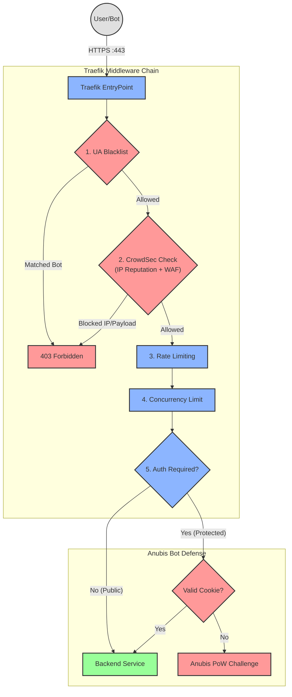

# 🛡️ Ironclad Anti-DDoS & Anti-Bot Stack

Hey there! Welcome to the **LGT Stack** (Traefik + CrowdSec + Anubis + Grafana).

> **Automated, resource-efficient protection for multi-domain Docker environments and legacy web servers.**

Are you tired of bots scraping your site, vulnerability scanners probing for WordPress exploits, or random layer-7 DDoS attacks taking down your apps at 3 AM? You've come to the right place. 

This stack wraps a bulletproof, multi-layered security blanket around your web applications with zero configuration drift. It uses **Traefik** to route traffic, **CrowdSec** as a collaborative WAF/IPS, **Anubis** as a cryptographic Proof-of-Work bot challenge, and **Grafana** + **Loki** to give you beautiful visibility into exactly who is trying to hit your servers.

---

## 📖 Table of Contents

- [🚀 Quick Start (Be up in 2 mins)](#-quick-start-be-up-in-2-mins)
- [🏗️ How It Works (The Architecture)](#%EF%B8%8F-how-it-works-the-architecture)
- [🌍 Domain Management](#-domain-management)
- [⚙️ Configuration Reference (.env)](#%EF%B8%8F-configuration-reference-env)
- [🔬 Deep Dive: The Components](#-deep-dive-the-components)
- [🛠️ Operations Manual](#%EF%B8%8F-operations-manual)
- [🦕 Legacy Apache Integration](#-legacy-apache-integration)

---

## 🚀 Quick Start (Be up in 2 mins)

We've made this as foolproof as possible. You don't need to manually edit YAML files or generate secrets. 

### Prerequisites
- **Docker Engine & Docker Compose** (v2.x+)
- **Make** (usually pre-installed, or via `sudo apt install make`)
- Ports `80` and `443` free on your machine.

### The 3-Step Setup

**1. Initialize the Environment**
Run the interactive wizard. It will ask you for your primary domain and what kind of SSL certificates you want (local, staging, or production).
```bash
make init
```

**2. Verify the Configuration**
Check that your `.env` is ready to go. The system will auto-generate strong passwords and cryptographic keys under the hood so you don't have to.
```bash
make validate
```

**3. Boot the Stack**
Our orchestrator (`start.sh`) will sync credentials, build the Traefik dynamic routers, boot the security layers first, and then bring up the rest of the stack.
```bash
make start
```

🎉 **You're done!** 
Head over to `https://dashboard.<your-domain>` to manage your sites, or `https://dashboard.<your-domain>/grafana` to see your metrics!

---

## 🏗️ How It Works (The Architecture)

This stack operates on a **"Defense in Depth"** principle. Every single HTTP request goes through a brutal gauntlet before it ever touches your app.

### The Golden Chain (Middleware Pipeline)



### Key Benefits
- **Multi-Layered Defense:** IP reputation (CrowdSec), payload inspection (AppSec WAF), PoW bot challenge (Anubis), rate limiting, and UA blocklists all in sequence.
- **Fail-Open Design:** If the security engines (CrowdSec/Redis) crash, Traefik lets traffic through so your site stays up. (Availability > Security by default).
- **Fully Automated:** You just edit a CSV file. The stack writes its own Traefik YAML configurations instantly via a Python engine (`generate-config.py`).
- **Complete Visibility:** Grafana + Loki gives you live dashboards and Telegram alerts for everything.

---

## 🌍 Domain Management

We got rid of manual Traefik labels. You just tell the stack what domains you want to protect using the `domains.csv` file (or via the Dashboard UI).

| Column | Description |
|:---|:---|
| **domain** | Full domain name (e.g., `shop.example.com`). |
| **redirection** | Target URL if this domain should redirect (e.g., `www.example.com`). |
| **service** | Docker container name (e.g. `wordpress-app`). It must be on the `traefik` network. |
| **anubis_sub** | The subdomain for the Anubis bot portal (e.g., `auth`). Leave empty for public access. |
| **rate_limit / burst / concurrency** | Custom overrides for DDoS protection limits. Leave blank for global defaults. |

**Example `domains.csv`:**
```csv
# domain,             redirection,     service,       anubis_sub,  rate, burst, concurrency
myshop.com,           ,                myshop-app,    auth,        50,   100,   20
www.myshop.com,       myshop.com,      myshop-app,    auth,        50,   100,   20
blog.com,             ,                blog-app,      ,            ,     ,
```

To apply changes, just click **"Restart Stack"** in the Dashboard, or run `make start` in the terminal. The system handles the rest.

---

## ⚙️ Configuration Reference (`.env`)

Your `.env` file is incredibly clean. All the messy, auto-calculated variables are handled dynamically by `start.sh` so you don't have to see them.

### General Settings
| Variable | Description | Default |
|----------|-------------|---------|
| `DOMAIN` | Your primary base domain. Used for the dashboard. | — |
| `PROJECT_NAME` | Prefix for Docker containers. | `stack` |
| `TZ` | Server timezone for logs and scheduled tasks. | `Europe/Madrid` |

### Security Limits & CrowdSec
| Variable | Description | Default |
|----------|-------------|---------|
| `CROWDSEC_ENABLE` | Master switch for the WAF/IPS. | `true` |
| `CROWDSEC_APPSEC_ENABLE` | Enable Layer-7 WAF (payload inspection). | `true` |
| `CROWDSEC_CAPTCHA_GRACE_PERIOD`| How long (in seconds) an IP is allowed through after solving a CrowdSec CAPTCHA. | `3600` |
| `TRAEFIK_GLOBAL_RATE_AVG` | Average requests per second allowed per IP. | `60` |
| `TRAEFIK_GLOBAL_CONCURRENCY` | Maximum simultaneous connections per IP (Slowloris defense). | `25` |

### SSL & Observability
| Variable | Description | Default |
|----------|-------------|---------|
| `TRAEFIK_ACME_ENV_TYPE` | Certificate mode: `production`, `staging`, or `local`. | `staging` |
| `TLS_BATCH_SIZE` | Size of the batch used when generating certificates. | `30` |
| `PROMETHEUS_RETENTION_DAYS` | How many days of metrics data to keep. | `15` |
| `PROMETHEUS_MEM_LIMIT` | RAM limit for Prometheus. Increase if storing lots of data. | `512M` |

> **Why don't I see passwords for Redis or CrowdSec here?**
> Because you shouldn't have to manage them! `start.sh` automatically generates 32-byte cryptographic keys for Redis, CrowdSec LAPI, and Flask sessions and injects them securely at runtime. Less work for you, much better security.

---

## 🔬 Deep Dive: The Components

### 1. CrowdSec (IPS + WAF)
CrowdSec reads your Traefik logs (for behavioral detection) and acts as an active WAF inspecting payloads on port `7422`. 
- **AppSec Engine:** Automatically blocks SQL Injections, XSS, and exploits using Virtual Patching.
- **CAPTCHAs:** Instead of a hard ban, CrowdSec can serve a CAPTCHA (Turnstile/reCAPTCHA). If the user solves it, they get a grace period defined by `CROWDSEC_CAPTCHA_GRACE_PERIOD`.
- **Profiles:** We enforce aggressive ban profiles (`config/crowdsec/profiles.yaml`). Repeat offenders get a 7-day ban automatically.

### 2. Anubis (Bot Defense)
When you add an `anubis_sub` to a domain in `domains.csv`, Traefik forces all visitors to solve a cryptographic Proof-of-Work challenge (rendered in JavaScript) before they can see the site.
- **Why?** It's computationally expensive for bots, but takes <2 seconds for a real browser.
- **State:** Sessions are stored in a highly optimized Valkey (Redis) container on a completely isolated internal network.

### 3. Traefik (Edge Router)
All Traefik dynamic config is generated dynamically via `scripts/generate-config.py`. 
- It sets up proper `Host()` rules.
- It applies the full middleware chain.
- It intercepts known bad bots (`TRAEFIK_BAD_USER_AGENTS`) at the very edge of the network before they even reach CrowdSec.

---

## 🛠️ Operations Manual

Day-to-day operations are handled via `Makefile`:

| Action | Command |
|--------|---------|
| **Start / update stack** | `make start` |
| **Stop stack** | `make stop` |
| **Restart full stack** | `make restart` |
| **Check config** | `make validate` |
| **Live log viewer** | `make logs` |
| **Manage bans** | `make crowdsec-decisions` |
| **Unban an IP** | `make crowdsec-unban 1.2.3.4` |
| **Check certificates** | `make certs-info` |

### Watchdog Alerts
The stack includes a lightweight Alpine watchdog that alerts you on Telegram if:
- A SSL certificate expires in <10 days.
- A domain stops resolving to your IP.
- CrowdSec crashes.
Just add your `WATCHDOG_TELEGRAM_BOT_TOKEN` in the `.env`! (Grafana Alerting will also automatically reuse this token to send you performance alerts).

---

## 🦕 Legacy Apache Integration

Still running some old PHP apps directly on the host machine? We've got you covered.
1. The stack probes port `8080` on the host machine (`172.17.0.1`) at startup.
2. If it detects Apache, it automatically creates a routing service called `apache-host`.
3. You can assign domains to `apache-host` in `domains.csv`, and they get the exact same CrowdSec/Anubis protection as your Docker containers!
4. We even auto-inject `docker-compose-apache-logs.yaml` so Alloy can scrape your host Apache logs and show them in Grafana Loki.

*(See the internal docs for how to configure `mod_remoteip` in Apache to see real client IPs).*

---
*Happy hosting. Keep this stack bulletproof.* 🛡️
