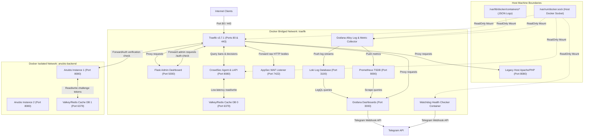
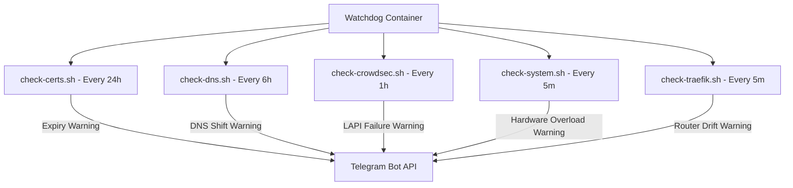
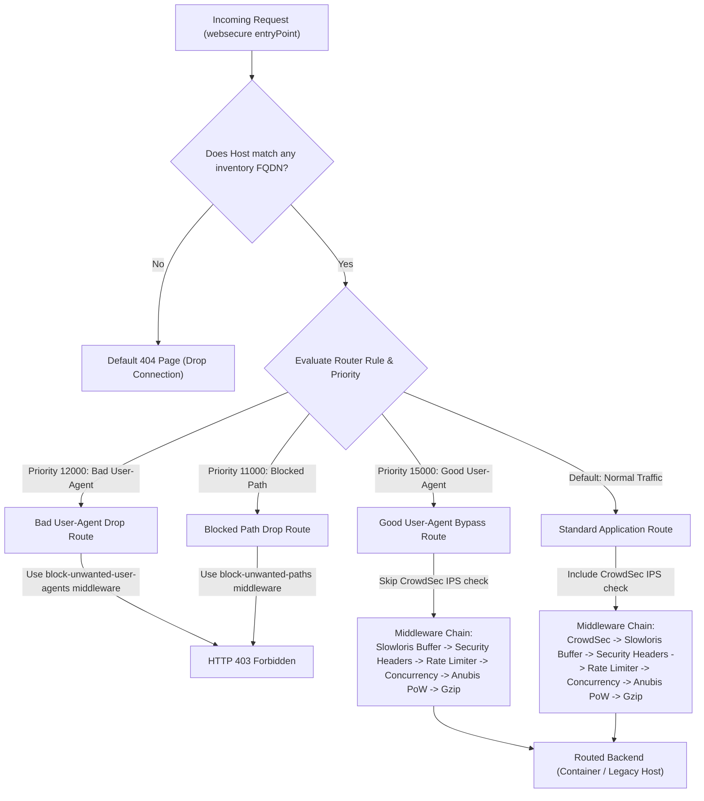
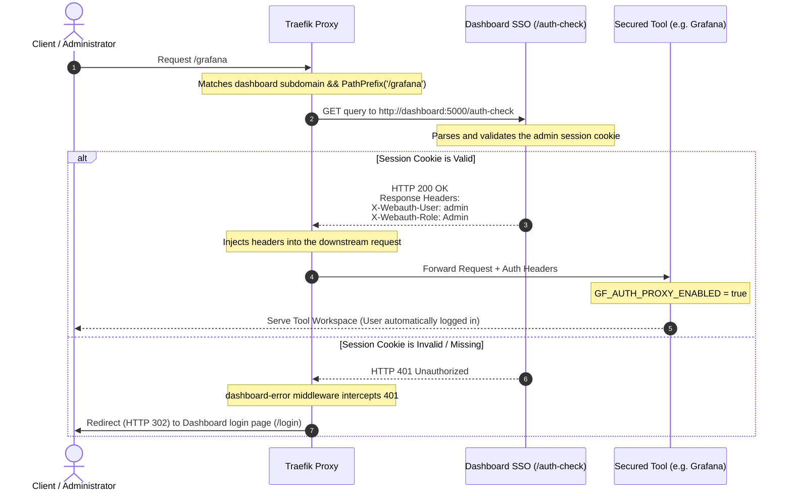
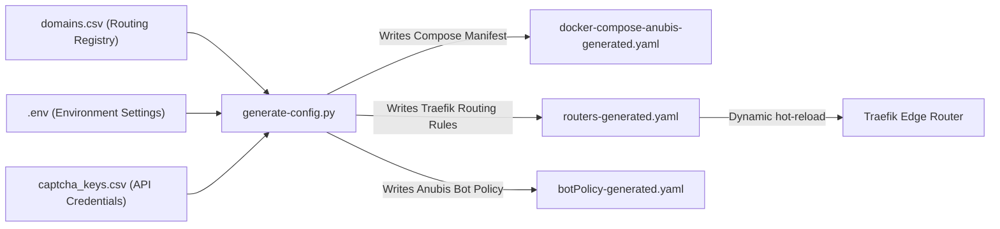
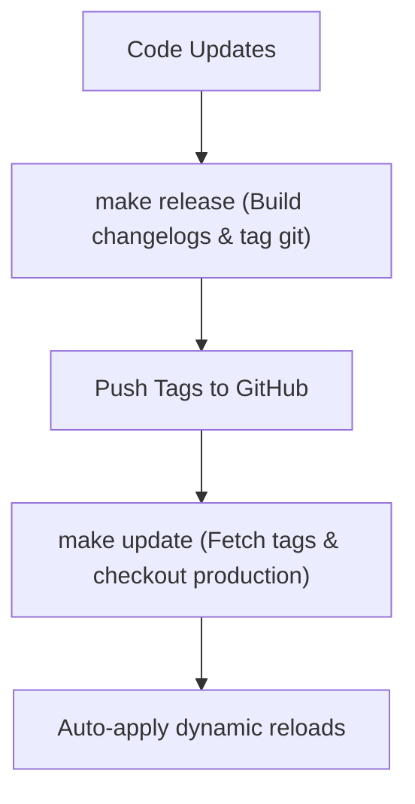

<div align="center">


# Traefik Pro Stack

**Your web. Locked down, lit up, production-ready.**

*Traefik + CrowdSec + Anubis + Grafana · Full-stack anti-DDoS & anti-bot infrastructure for multi-domain Docker environments.*

[](LICENSE)
[](https://doc.traefik.io/traefik/)
[](https://crowdsec.net)
[](https://anubis.techaro.lol/docs/)
[](https://grafana.com)
[](https://prometheus.io)
[](https://redis.io)
[](https://docs.docker.com/compose/)

</div>

---

## Table of Contents
1. [Overview and Core Capabilities](#overview-and-core-capabilities)
2. [System Architecture and Component Design](#system-architecture-and-component-design)
3. [Port and Interface Allocations](#port-and-interface-allocations)
4. [Prerequisites and System Preparation](#prerequisites-and-system-preparation)
5. [Step-by-Step Quick Start Guide](#step-by-step-quick-start-guide)
6. [Comprehensive Repository Layout](#comprehensive-repository-layout)
7. [Security Model and Border Middleware Flow](#security-model-and-border-middleware-flow)
8. [CrowdSec AppSec WAF and Custom Scenarios](#crowdsec-appsec-waf-and-custom-scenarios)
9. [Operational Automation Scripts](#operational-automation-scripts)
10. [Detailed Environment Variables Configuration](#detailed-environment-variables-configuration)
11. [Domain Routing Inventory Design](#domain-routing-inventory-design)
12. [Makefile Administration Command Registry](#makefile-administration-command-registry)
13. [Release and Upgrade Pipeline](#release-and-upgrade-pipeline)
14. [Special Operational Modes](#special-operational-modes)
15. [FAQ and Operational Troubleshooting](#faq-and-operational-troubleshooting)
16. [License](#license)

---

## Overview and Core Capabilities

The Traefik Pro Stack is an integrated, self-hosted, and production-grade edge gateway infrastructure designed to provide defense-in-depth security, mitigation of automated attacks, and comprehensive system visibility. Optimized for multi-domain Docker environments, it routes, secures, and monitors traffic directed to containerized web applications as well as legacy non-containerized services running on the host network.

Instead of relying on basic reverse proxies that require manually maintained configuration files and static certificates, this stack uses dynamic configuration generation driven by a simple domain inventory. It binds edge-routing routing logic directly to an active intrusion prevention system (IPS), a web application firewall (WAF), a proof-of-work (PoW) bot-challenge mechanism, and a modern telemetry pipeline.

### Core Strengths

*   **Border Routing and Automatic TLS**: Driven by Traefik v3.x, the stack handles HTTP, HTTPS, and HTTP/3 (QUIC) connections. It automatically negotiates and renews Let's Encrypt certificates, organizing domains dynamically into optimal groupings to prevent rate limit penalties. It also features a fully local developer mode using trust-injected self-signed certificates.
*   **Behavioral Intrusion Prevention and WAF**: Powered by CrowdSec IPS and CrowdSec AppSec. The security engine continuously analyzes logs from all services to identify and block scanning tools, brute-force attempts, and anomalous behavior. The Layer-7 AppSec engine acts as an inline WAF, intercepting payloads to block common web application attacks such as SQL injection (SQLi), Cross-Site Scripting (XSS), and Remote Code Execution (RCE) using standard OWASP Rulesets.
*   **Cryptographic Challenge Mitigation**: Integrating the Anubis Proof-of-Work engine. When a domain is protected, unauthenticated web browsers are presented with a lightweight cryptographic puzzle. Resolving this puzzle requires a brief computing effort on the client-side (typically 1 to 3 seconds), verifying that the user is operating a standard browser rather than a scraper or headless bot. Successful verification issues a token signed with an Ed25519 private key, granting access for a configurable timeframe.
*   **Single Sign-On and Access Control**: A centralized Python/Flask administrative dashboard allows you to manage routing settings, inspect certificate health, and oversee captcha keys. This dashboard integrates directly into Traefik using its ForwardAuth middleware to serve as a Single Sign-On (SSO) gateway, protecting administrative interfaces (Dozzle logs, Traefik's internal API dashboard, Grafana, and the CrowdSec LAPI console) behind a unified, session-secured portal.
*   **Observability Pipeline**: Telemetry is structured via Grafana Alloy, Loki, Prometheus, and Grafana. Alloy discovers running containers, parses access logs, and scrapes Prometheus endpoints. Logs are shipped to Loki and metrics to Prometheus, feeding pre-configured Grafana dashboards that display security statistics, system resources, and request routing anomalies.
*   **System Watchdog**: An isolated background daemon monitors certificate lifetimes, domain DNS resolutions, host hardware metrics (CPU, memory, disk, and IO), and Traefik dynamic configuration drift. Any anomalies trigger notifications dispatched directly to a Telegram group.
*   **Automated Backups**: An optional Backrest service (Restic + Rclone) provides encrypted, deduplicated backups to cloud storage (Dropbox, Google Drive, S3, etc.). A two-layer strategy separates database dump generation (LXC cron) from backup orchestration (Backrest scheduler), keeping the backup container isolated with read-only access to project files.
*   **Fail-Open Border Resilience**: To prevent operational downtime, the CrowdSec integration is configured as fail-open. If the security database, the WAF listener, or the session cache goes offline, edge traffic is permitted to flow through rather than being dropped, maintaining availability under anomalous conditions.

---

## System Architecture and Component Design

The stack relies on network segregation and credential isolation. Containers are mapped to specific Docker networks depending on their security profiles and data requirements.

### Network Topologies

1.  **The traefik Network (External/Bridged)**: This is the primary edge routing network. It connects the Traefik proxy container to all backend applications that require public routing. It also contains the admin dashboard, the observability suite (Alloy, Prometheus, Loki, Grafana), and the CrowdSec firewall agent.
2.  **The anubis-backend Network (Internal/No Egress)**: This is a hardened, isolated network. It connects Anubis challenge verification servers to a dedicated Redis/Valkey cache database. To limit the attack surface, this network is completely internal, meaning no container attached to it can initiate outbound connections to the host or the public internet. It exists solely to perform session cache lookups and validate proof-of-work challenges.

### Component Inter-Connectivity Model

The system components interact across network namespaces and host mount boundaries. This ensures that security tools have low-latency access to cache stores while maintaining strict service segregation:



### Watchdog Diagnostics Subsystem

The Watchdog service runs as a decoupled daemon container. Rather than running a monolithic checking process, it initializes multiple sub-shells running in parallel at different sleep intervals, reporting failures via Telegram:



---

## Port and Interface Allocations

To ensure network isolation and avoid socket binding conflicts, the stack maps services to the following default ports. Public access is filtered strictly through Traefik ports `80` and `443` on the host, while internal services are exposed only inside the isolated Docker network namespaces:

| Service | Internal Port | External Host Port | Scope / Network | Description |
|:---|:---|:---|:---|:---|
| `traefik` | `80`, `443` | `80`, `443` (TCP/UDP) | `traefik` / Host | Public HTTP, HTTPS, and HTTP/3 boundary |
| `traefik-api` | `8080` | None | `traefik` (isolated) | Traefik internal API and dashboard |
| `dashboard` | `5000` | None | `traefik` (SSO auth-check) | Flask Admin Dashboard and SSO validation |
| `crowdsec-lapi` | `8080` | None | `traefik` | Local API engine for log parsing alerts |
| `crowdsec-appsec` | `7422` | None | `traefik` | Inline AppSec WAF payload inspection |
| `crowdsec-web-ui` | `3000` | None | `traefik` | Management dashboard UI for CrowdSec |
| `redis` (Cache) | `6379` | None | `traefik` & `anubis-backend` | Valkey cache server (DB 0: Bans, DB 1: PoW sessions) |
| `redis-exporter` | `9121` | None | `traefik` | Metric exporter for Prometheus scraping |
| `anubis-base` | `8080` | None | `traefik` & `anubis-backend` | Proof-of-Work challenge verification instances |
| `anubis-assets` | `80` | None | `traefik` | Static file delivery for PoW challenge layouts |
| `grafana` | `3000` | None | `traefik` | Telemetry dashboards and alert provisioning |
| `prometheus` | `9090` | None | `traefik` | Metrics TSDB and scrapers |
| `loki` | `3100` | None | `traefik` | Log archive aggregation database |
| `alloy` | `12345` | None | `traefik` / Host logs | Grafana Alloy collector service |
| `dozzle` | `8080` | None | `traefik` | Container logs web console viewer |
| `backrest` | `9898` | None | `traefik` | Restic backup Web UI (optional, controlled by `BACKREST_ENABLE`) |
| `apache-host` | `8080` | `8080` | Host Network | Legacy Apache web service running on the host |

---

## Prerequisites and System Preparation

Deploying the stack requires preparing the host system's kernel, network bindings, and directory permissions.

### Host Specifications

1.  **Operating System**: Linux kernel v4.15 or later. The kernel must have support for `sysctl` overrides (such as `net.core.somaxconn` and `net.ipv4.tcp_syncookies`) to handle high connection spikes and mitigate SYN flood attempts at the networking layer.
2.  **Docker Runtime**: Docker Engine v24.0.0 or later. Docker must be configured to run as a systemd service, and the docker daemon socket (`/var/run/docker.sock`) must be accessible to the deploying user (or accessible via sudo).
3.  **Compose Plugin**: Docker Compose v2.20.0 or later (invoked as `docker compose`). Legacy versions (Compose V1, `docker-compose`) are not compatible due to the modular config features utilized.
4.  **Python Environment**: Python 3.8 or later, including the `venv` and `pip` packages. This environment is used to run local configuration generation scripts, perform environment variable validations, and inspect local certificates.
5.  **Network Socket Allocation**: Ports `80` (HTTP) and `443` (HTTPS/UDP for HTTP/3-QUIC) must be completely open and unallocated on all host interfaces. If another web server (such as standalone Nginx or Apache) is running on the host, it must be stopped or bound to a different port.
6.  **Loopback Redirection (Optional)**: If you plan to route requests to a legacy non-containerized service running on the host, the host firewall must permit connections on the Docker interface gateway (usually `172.17.0.1` or `172.16.0.1`) on the target port (e.g., `8080`).

---

## Step-by-Step Quick Start Guide

### Step 1: Initialize the Environment

Before bringing up the container stack, initialize the localized environment configurations. Run the following command from the repository root:

```bash
make init
```

This target launches an interactive configuration wizard (`scripts/initialize-env.sh`) that performs the following tasks:
1.  Verifies the presence of Python 3 and creates an isolated virtual environment (`.venv`).
2.  Installs the necessary requirements (such as `pyyaml` and `tldextract`) inside the virtual environment.
3.  Creates your local `.env` configuration file from the template (`.env.dist`).
4.  Prompts you for essential parameters (primary domain name, project name, timezone, SSL registration email, ACME environment type, Anubis difficulty, CrowdSec collections, rate limits, and administrator credentials).

Note that cryptographic secrets (`DASHBOARD_SECRET_KEY`, `REDIS_PASSWORD`, `ANUBIS_REDIS_PRIVATE_KEY`, `CROWDSEC_LAPI_KEY`, and `CROWDSEC_WEB_UI_PASSWORD`) are **not** generated during `make init`. They are auto-generated on the first `make start` execution when `start.sh` detects that these values are empty or set to their placeholder defaults. This design ensures that keys are only created once and are never silently overwritten on subsequent startups.

### Step 2: Customize Environment Variables

Open the generated `.env` file in a text editor to verify the settings. Pay attention to:
*   `DOMAIN`: Set this to your primary root domain (e.g., `company.com`).
*   `TRAEFIK_ACME_ENV_TYPE`: Set this to `staging` during initial setup. Staging requests certificates from Let's Encrypt's staging authority, which does not enforce strict rate-limiting rules. Once you verify that routing and certificate negotiation succeed, change this value to `production` and restart the stack to acquire trusted certificates.
*   `TRAEFIK_ACME_EMAIL`: Ensure this email is valid, as Let's Encrypt uses it to deliver expiration alerts.

### Step 3: Populate the Domain Inventory

Open the `domains.csv` file. This inventory file acts as the single source of truth for routing. Add a line for each subdomain or domain you wish to expose:

```csv
# domain, redirection, docker_service, anubis_subdomain, rate, burst, concurrency
company.com, , landing-web, , , ,
www.company.com, company.com, landing-web, , , ,
crm.company.com, , crm-app, auth, 40, 80, 20
```

For each domain:
*   Define the FQDN (`domain`).
*   Configure optional redirect rules (`redirection`).
*   Set the backend Docker container name (`docker_service`).
*   Configure the Anubis PoW subdomain (`anubis_subdomain`) to enable cryptographic challenge protection on that route.
*   Define custom rate-limiting rules (`rate`, `burst`, `concurrency`) if the global defaults are not appropriate.

### Step 4: Launch the Stack

Run the startup target:

```bash
make start
```

This script executes the startup orchestrator (`scripts/start.sh`), which processes configurations in six sequential phases:
1.  **Phase 1 -- Environment Preparation**: Merges any new variables from `.env.dist` into your local `.env` without overwriting existing values, preserves custom variables not present in the template, and runs critical validation checks (domain, ACME type, email, trivial passwords).
2.  **Phase 2 -- Credential Synchronization and Config Compilation**: Auto-generates any missing cryptographic secrets (dashboard key, Redis password, Anubis signing key, CrowdSec API key, Web UI password). Detects the ACME environment type to set the correct Let's Encrypt CA server. Compiles `traefik-generated.yaml` from its template via `sed` substitution, generates `redis-generated.conf` with the active password, builds `acquis.yaml` from `acquis-base.yaml` (appending the AppSec listener block if enabled), compiles `profiles.yaml` from `profiles-base.yaml` (conditionally injecting CAPTCHA remediation), toggles the `traefik-flood-429` custom scenario based on `CROWDSEC_RATE_LIMIT_BAN_ENABLE`, and executes `generate-config.py` to produce Traefik dynamic routers, Anubis Compose manifests, and bot policy files from `domains.csv`.
3.  **Phase 3 -- Application Assets and Local SSL**: Creates persistent data directories under `./data/` with correct ownership for non-root containers (Grafana UID 472, Loki UID 10001, Prometheus UID 65534). Copies `.dist` default assets for the Anubis challenge screen if no custom overrides exist. If the ACME environment is set to `local`, invokes `create-local-certs.sh` to generate trusted mkcert certificates and writes `local-certs.yaml` into the dynamic configuration folder.
4.  **Phase 4 -- Network and Security Layer Preparation**: Generates the CrowdSec IP whitelist parser from configured safe IPs and Docker internal ranges. Creates the `traefik` (external bridged) and `anubis-backend` (internal, no egress) Docker networks if they do not already exist. Probes the host for a legacy Apache service via TCP socket check and builds the final Compose file list using `compose-files.sh`.
5.  **Phase 5 -- Security-First Boot**: Boots Redis and CrowdSec before any other service. Holds the deployment pipeline in a health-check loop (up to 60 seconds) until CrowdSec LAPI reports healthy, ensuring that no unprotected routing goes live. Once healthy, it registers the Traefik bouncer API key in the LAPI database (deleting and re-creating it each time for idempotency), hardens the LAPI `trusted_ips` configuration using `yq`, registers the CrowdSec Web UI machine credential, and optionally enrolls the instance with the CrowdSec Console if an enrollment key is configured.
6.  **Phase 6 -- Full Stack Deployment**: Launches all remaining containers (Traefik, Grafana, Alloy, Prometheus, Loki, Dashboard, Dozzle, Watchdog, Anubis instances) with `--remove-orphans` to clean up stale containers. Verifies DNS resolution for core subdomains (e.g., `dashboard.DOMAIN`) and prints warnings for any missing records. Finally, the Makefile automatically invokes `grafana-setup-telegram` to provision Grafana's Telegram alerting contact point and notification policy if valid bot credentials are present.

### Step 5: Validate System Health

Once the deployment concludes, run the diagnostics check:

```bash
make health
```

This command queries the status of core APIs and confirms that permissions on sensitive files (such as `.env` and `acme.json`) are set to read-only for their respective processes.

---

## Comprehensive Repository Layout

This section details the layout of the project, including configuration files, templates, and orchestration scripts.

```
.
├── .env.dist                              # Master template for environment configuration variables
├── .env                                   # Local configuration file (git-ignored)
├── domains.csv.dist                       # Master template for domain routing rules
├── domains.csv                            # Active domain routing settings (git-ignored)
├── Makefile                               # System management command wrapper
├── VERSION                                # Current CalVer release tag (e.g. 2026.05.25)
│
├── scripts/                               # Automation and health verification scripts
│   ├── backup-traefik-stack.sh            # Creates timestamped configuration backups
│   ├── backup-db-dumps.sh                # LXC cron script: dumps all Docker databases to disk
│   ├── LXC_DEBIAN_SETUP.md               # Proxmox LXC deployment and backup strategy guide
│   ├── compose-files.sh                   # Builds the active Compose file list dynamically
│   ├── create-local-certs.sh              # Automates self-signed CA and certificate generation
│   ├── crowdsec-geoblock.sh               # Downloads CIDR blocks to block geo-specific traffic
│   ├── generate-config.py                 # Core compiler translating domains.csv into routing rules
│   ├── health.sh                          # Runs diagnostics on containers, APIs, and file systems
│   ├── initialize-env.sh                  # Interactive setup wizard for initializing .env
│   ├── inspect-certs.py                   # Reads acme.json to report certificate details
│   ├── maintenance.sh                     # Manages the global maintenance mode container and routing rules
│   ├── prune-certs.py                     # Identifies and removes unused certificate entries
│   ├── release.sh                         # Standardizes new releases by updating changelogs and git tags
│   ├── requirements.txt                   # Local Python package requirements
│   ├── restart-internal.sh                # Executed by Flask UI to perform safe stack reloads
│   ├── restore.sh                         # Restores configuration files from a backup archive
│   ├── rollback.sh                        # Provides interactive checkout to previous git release tags
│   ├── setup-grafana-alerting.sh          # Sets up Grafana's alerting configuration via API
│   ├── start.sh                           # Executes the security-first stack launch pipeline
│   ├── stop.sh                            # Stops containers and tears down network bridges
│   ├── update.sh                          # Safe git checkout pipeline for upgrading production stacks
│   ├── validate-env.py                    # Validates .env files for missing keys and type correctness
│   └── make/                              # Makefile target plugins
│       ├── certs.mk                       # mkcert commands (loaded if TRAEFIK_ACME_ENV_TYPE=local)
│       ├── crowdsec.mk                    # Metrics and ban management targets
│       └── grafana.mk                     # Telegram setup and testing targets
│
├── config/                                # Service-specific configurations and templates
│   ├── traefik/
│   │   ├── traefik.yaml.template          # Static config template processed during startup
│   │   ├── traefik-generated.yaml         # Compiled static configuration (do not edit)
│   │   ├── acme.json                      # Let's Encrypt certificate store (plaintext JSON, strict 600 perms)
│   │   ├── captcha.html                   # HTML template served during CrowdSec CAPTCHA checks
│   │   ├── certs-local-dev/               # Folder storing mkcert developer certificates
│   │   └── dynamic-config/                # Auto-generated routing files from python script
│   │
│   ├── crowdsec/
│   │   ├── acquis-base.yaml              # Static log ingestion source definitions
│   │   ├── acquis.yaml                   # Final compiled log ingestion settings
│   │   ├── config.yaml.local             # Host-specific engine configuration overrides (WAL, db retention, trusted IPs)
│   │   ├── profiles-base.yaml            # Remediations base profile template
│   │   ├── profiles.yaml                 # Compiled remediation profiles and durations
│   │   ├── captcha_keys.csv              # Registrar mapping domains to captcha keys
│   │   ├── parsers/                      # Custom parsers (contains auto-generated IP whitelists)
│   │   └── scenarios/                    # Custom behavioral detection rules (e.g. rate limit floods)
│   │
│   ├── anubis/
│   │   ├── botPolicy.yaml                # Bot filtering rules (Googlebot whitelist, workers blacklist)
│   │   └── assets/                       # Custom stylesheets and image assets for the PoW screen
│   │
│   ├── dashboard/                        # Flask admin dashboard application
│   │   ├── app.py                        # Server code managing SSO and domains.csv updates
│   │   └── Dockerfile                    # Container build configuration
│   │
│   ├── maintenance/
│   │   └── index.html                    # Offline maintenance page HTML
│   │
│   ├── grafana/
│   │   ├── dashboards/                   # Bundled JSON dashboards
│   │   └── provisioning/                 # Declarative datasource and dashboard allocations
│   │
│   ├── loki/                             # Loki log aggregation configuration
│   ├── prometheus/                       # Prometheus scraper definitions and rules
│   ├── valkey/                           # Valkey cache configuration templates
│   ├── alloy/                            # Grafana Alloy metric and log ingestion pipelines
│   ├── backrest/                         # Backrest state: config, data, rclone credentials (git-ignored)
│   └── watchdog/                         # Watchdog monitor scripts
│
└── docker-compose-*.yaml                  # Modular Compose files divided by service areas
```

> [!IMPORTANT]
> The dynamic files listed in `.gitignore` (such as `acquis.yaml`, `profiles.yaml`, `docker-compose-anubis-generated.yaml`, `traefik-generated.yaml`, `valkey-generated.conf`, and `botPolicy-generated.yaml`) are built on every boot sequence. Do not modify these files directly as they are overwritten by `make start`. Make changes inside the `.dist` files or generator templates instead.

---

## Security Model and Border Middleware Flow

To protect backend services, incoming requests must pass through a multi-tier security filter enforced by Traefik's routing engine.

### Border Router Evaluation Pipeline

When a request arrives on the HTTP/HTTPS interfaces, Traefik evaluates the host headers and paths against the generated routers. The rule evaluation respects strict priority rankings:



### SSO Forward Authentication Protocol

To protect internal administrative components (such as Grafana, Dozzle, and the Traefik dashboard), the Flask dashboard acts as a ForwardAuth provider. Traefik intercepts incoming admin queries and routes them through a validation sequence:



---

## CrowdSec AppSec WAF and Custom Scenarios

The CrowdSec AppSec component provides Web Application Firewall (WAF) capabilities inside the edge proxy stack, enabling Layer-7 payload inspection. It is built to block exploitation attempts targeting vulnerabilities such as SQL injection, Cross-Site Scripting, Local/Remote File Inclusion (LFI/RFI), and arbitrary code execution before they reach backend application containers.

### Component Architecture

The WAF operates using a decentralized inspection pipeline:

```
Client Request ──► [ Traefik Proxy ] ──► (Bouncer Plugin)
                                              │
                                              ▼ (HTTP/REST Call)
                                     [ CrowdSec AppSec ] (Port 7422)
                                              │
                                              ├─► Coraza Engine (SecRules CRS)
                                              │
                                              ▼ (Evaluation Output)
Client Request ◄── [ Block 403 / Allow ] ◄────┘
```

1.  **Proxy Payload Forwarding**: The Traefik bouncer plugin intercepts incoming HTTP requests. When AppSec is enabled, the bouncer packages the request headers, parameters, and body, transmitting them via a local HTTP call to the WAF listener running inside the `crowdsec` container on port `7422`.
2.  **Inline Rule Evaluation**: The WAF listener uses Coraza (a high-performance, Go-based, ModSecurity-compatible WAF engine). It evaluates the request details against the active AppSec rulesets.
3.  **Remediation Loop**: If the request matches a malicious pattern:
    *   The AppSec listener returns a block instruction back to the Traefik bouncer plugin.
    *   Traefik immediately halts request execution and serves an HTTP `403 Forbidden` response to the client.
    *   The event is sent to LAPI, creating a security alert and initiating a temporary or permanent IP ban across the stack.

### Rule Ingestion and Configuration

The WAF settings are integrated into the automated startup pipeline:

*   **Dynamic Rule Ingest**: If `CROWDSEC_APPSEC_ENABLE=true` is set in `.env`, the startup script (`start.sh`) modifies `/etc/crowdsec/acquis.yaml` to declare the AppSec listener port `7422` and injects `crowdsecurity/appsec-virtual-patching` and `crowdsecurity/appsec-generic-rules` into the collections registry. This automatically pulls the latest virtual patches and generic web protection rules from the CrowdSec hub.
*   **Fail-Open WAF Operations**: In line with the stack's resilience goals, WAF checks are configured as fail-open by default (`crowdsecAppsecFailureBlock: false` and `crowdsecAppsecUnreachableBlock: false` inside `generate-config.py`). If the AppSec daemon experiences extreme load or crashes, traffic continues to route normally without generating false-positive service outages.
*   **Immediate Remediation Profiles**: While standard HTTP behavior anomalies (such as brute force or rapid scanning) trigger temporary CAPTCHA challenges to allow human recovery, AppSec WAF triggers bypass CAPTCHAs. In `config/crowdsec/profiles.yaml`, the captcha rule filters out AppSec triggers (`!(Alert.GetScenario() contains "appsec")`), sending WAF matches directly to the aggressive 24-hour IP ban remediation, as payload vulnerabilities represent high-confidence attack signatures.

> [!WARNING]
> If you register custom site key mappings inside `config/crowdsec/captcha_keys.csv` but fail to add the domain to the widget console settings on Cloudflare Turnstile or hCaptcha, the CAPTCHA script will block users with an unsolvable site-key configuration error.

### Custom Rate-Limit Flood Scenario (Leaky Bucket)

To complement Traefik's application-level rate limiting, the stack incorporates a custom behavioral scenario: `custom/traefik-flood-429`.

#### Purpose and Mechanics

By default, Traefik's rate-limiting middleware operates in memory. When a client exceeds the threshold, Traefik throttles the request and returns an HTTP `429 Too Many Requests` status code. However, Traefik itself does not block the client at the IP layer. A malicious scanner or script could continue to flood the proxy, consuming CPU and network capacity.

The `traefik-flood-429` scenario bridges this gap by scanning Traefik's access logs:
1. **Event Detection**: Each log entry carrying an HTTP status code `429` is parsed.
2. **Leaky Bucket Accumulation**: The scenario uses a Leaky Bucket model:
   * **Capacity (50 tokens)**: The maximum number of 429 errors allowed before overflow.
   * **Leak Speed (1s)**: The rate at which the bucket drains (1 token per second).
3. **Overflow Action**: If an IP triggers rate limiting repeatedly and exceeds 50 accumulated events (meaning it triggers 429s faster than the 1s leak rate), the bucket overflows.
4. **Remediation**: The overflow event is reported to the LAPI engine, which immediately applies a 24-hour IP ban, dropping all traffic from that IP at the proxy perimeter.

#### Tuning and Configuration

* **Default Lenient Settings**: Out of the box, the scenario template (`traefik-flood-429.yaml.dist`) is tuned to `capacity: 50` and `leakspeed: 1s`. This prevents false positives during normal AJAX-heavy dashboard actions (such as WordPress updates) while ensuring aggressive automated scanners are quickly banned.
* **Disabling the Scenario**: If your site uses highly concurrent or non-cached AJAX operations that trigger false bans, you can disable the scenario by setting `CROWDSEC_RATE_LIMIT_BAN_ENABLE=false` in `.env`.
* **Rate Limits Optimization**: Rather than relaxing Traefik's global limits in `.env` (which might expose other services), it is recommended to apply custom rate, burst, and concurrency parameters in `domains.csv` specifically for AJAX-heavy subdomains.

---

## Operational Automation Scripts

The automation scripts in the `scripts/` directory handle stack lifecycle, configuration validation, and diagnostics:

*   **`start.sh`**: Handles stack startup. It runs validation checks on configuration files, generates dynamic settings for Traefik and Redis, verifies directory structures under `./data`, creates missing bridge networks, boots security services, and registers API keys in CrowdSec.
*   **`stop.sh`**: Shuts down the stack. It resolves the active Compose files, stops running containers, tears down the network bridges, and removes temporary runtime flags.
*   **`generate-config.py`**: Compiles routing rules. It reads `domains.csv`, checks for CAPTCHA credentials matching the root domains, groups subdomains into SAN certificate batches, and generates Traefik's dynamic routing files and Compose manifests.
*   **`health.sh`**: Runs diagnostics. It verifies that `.env` and `acme.json` permissions are restricted to `600`, queries container APIs, and confirms that database caches are responsive.
*   **`setup-grafana-alerting.sh`**: Provisions Grafana notifications. It runs inside the Grafana container, checks for active Telegram bot credentials, registers the contact point, and configures notification routing policies.
*   **`crowdsec-geoblock.sh`**: Handles geographic blocking. It downloads CIDR blocks for specified country codes from IPDeny and runs batch commands inside the CrowdSec container to block or unblock geographic zones.
*   **`maintenance.sh`**: Manages maintenance mode. It creates a flag file that updates the Compose manifests list, starting an Nginx container that serves the offline template for all public routes while keeping the admin dashboard accessible.
*   **`create-local-certs.sh`**: Automates local certificates. It checks for `mkcert` on the host, creates a local Root CA, and signs self-signed certificates for all domains listed in `domains.csv`.

### Config Generation Pipeline

The generation pipeline maps user configurations to the dynamic layers of the stack:



---

## Detailed Environment Variables Configuration

The environment configuration is split into system-managed variables and user-configured variables:

### System-Managed Variables

These keys must not be edited manually in the `.env` file, as the startup script automatically updates them on each boot to ensure system integrity:

*   `DASHBOARD_SECRET_KEY`: Used by the Flask dashboard to sign session cookies.
*   `CROWDSEC_WEB_UI_PASSWORD`: Internal database password for the CrowdSec console client.
*   `REDIS_PASSWORD`: Access password for the Valkey/Redis cache database.
*   `ANUBIS_REDIS_PRIVATE_KEY`: Private Ed25519 signing key for Anubis PoW cookies.
*   `CROWDSEC_LAPI_KEY`: API bouncer key used by Traefik to query the CrowdSec LAPI.
*   `TRAEFIK_CERT_RESOLVER`: Set to `le` (Let's Encrypt) in production and staging, or left blank in local mode.

### User-Configured Variables

These variables control system behaviors, resource limits, timeouts, and notification credentials:

| Variable | Scope | Default / Example | Description and Operational Impact |
|:---|:---|:---|:---|
| `DOMAIN` | General | `company.com` | Primary root domain name. Used to resolve the admin dashboard URL and identify host systems in Telegram alerts. |
| `TZ` | General | `Europe/Madrid` | System timezone. Restructures the timestamps in log exports, Grafana Alloy pipelines, and Prometheus cron loops. |
| `PROJECT_NAME` | General | `stack` | Namespace prefix for Compose containers. Customize if running multiple stack instances on the same host. |
| `ANUBIS_DIFFICULTY` | Anubis | `4` | Cryptographic puzzle difficulty (1-5 scale). Values of `3` or `4` are recommended. Setting this to `5` will consume high client CPU resources. |
| `ANUBIS_CPU_LIMIT` | Anubis | `0.10` | CPU core allocation limit per Anubis container (e.g. `0.10` = 10% of a single core). Prevents CPU starvation during bot floods. |
| `ANUBIS_MEM_LIMIT` | Anubis | `32M` | Memory limits allocated to each Anubis challenge instance. |
| `CROWDSEC_ENABLE` | CrowdSec | `true` | Toggles the CrowdSec IPS firewall bouncer. Setting to `false` disables the firewall. |
| `CROWDSEC_UPDATE_INTERVAL` | CrowdSec | `15` | Interval in seconds for the bouncer to pull LAPI decisions. Lowering this increases CPU load; `15` is optimal. |
| `CROWDSEC_ENROLLMENT_KEY` | CrowdSec | (blank) | Enrollment key to register the local LAPI engine with the CrowdSec SaaS console page. |
| `CROWDSEC_APPSEC_ENABLE` | CrowdSec | `true` | Toggles the WAF payload inspector on port `7422`. |
| `CROWDSEC_COLLECTIONS` | CrowdSec | (space-separated) | Space-separated list of scenarios to pull from the hub (e.g., `crowdsecurity/traefik crowdsecurity/sshd crowdsecurity/http-dos`). |
| `CROWDSEC_WHITELIST_IPS` | CrowdSec | (blank) | Comma-separated list of client IPs or CIDR subnets that bypass all firewall blocks. |
| `CROWDSEC_CAPTCHA_GRACE_PERIOD` | CrowdSec | `3600` | Period in seconds a user is allowed to navigate after solving a CAPTCHA before re-challenging. |
| `CROWDSEC_RATE_LIMIT_BAN_ENABLE` | CrowdSec | `true` | Toggles the custom `traefik-flood-429` ban scenario. Set to `false` to prevent false-positive bans due to heavy AJAX requests (e.g. WordPress). |
| `TRAEFIK_LISTEN_IP` | Traefik | `0.0.0.0` | Bind address for ports 80 and 443. Set to `127.0.0.1` if you use an external load balancer. |
| `TRAEFIK_GLOBAL_RATE_AVG` | Traefik | `60` | Default requests/second limit per client IP. |
| `TRAEFIK_GLOBAL_RATE_BURST` | Traefik | `120` | Default request burst bucket capacity per client IP. Controls temporary spikes. |
| `TRAEFIK_GLOBAL_CONCURRENCY` | Traefik | `25` | Default maximum concurrent sockets per client IP. |
| `TRAEFIK_TIMEOUT_ACTIVE` | Traefik | `60` | HTTP request active read/write timeout in seconds. |
| `TRAEFIK_TIMEOUT_IDLE` | Traefik | `90` | HTTP keep-alive connection timeout in seconds. Must be larger than `TRAEFIK_TIMEOUT_ACTIVE`. |
| `TRAEFIK_BLOCKED_PATHS` | Traefik | (blank) | Comma-separated path suffixes blocked immediately at the proxy perimiter. |
| `TRAEFIK_BAD_USER_AGENTS` | Traefik | (blank) | Comma-separated User-Agent regex patterns to drop immediately (e.g. `(?i).*curl.*`). |
| `TRAEFIK_GOOD_USER_AGENTS` | Traefik | (blank) | Comma-separated User-Agent regex patterns allowed to bypass bouncer stream bans. |
| `TRAEFIK_ACCESS_LOG_BUFFER` | Traefik | `1000` | Number of log entries buffered in RAM before committing disk write actions. |
| `TRAEFIK_LOG_LEVEL` | Traefik | `INFO` | Traefik internal verbosity logging level (`DEBUG`, `INFO`, `WARN`, `ERROR`). |
| `TRAEFIK_HSTS_MAX_AGE` | Traefik | `31536000` | HSTS header lifetime in seconds. |
| `TRAEFIK_FRAME_ANCESTORS` | Traefik | (blank) | Allowed parent URLs allowed to iframe resources (defaults to empty, meaning `SAMEORIGIN` restrictions). |
| `TRAEFIK_ACME_EMAIL` | Traefik | (blank) | Let's Encrypt email used to notify of certificate expirations. |
| `TRAEFIK_ACME_ENV_TYPE` | Traefik | `staging` | Let's Encrypt environment (`production`, `staging`, or `local`). |
| `TRAEFIK_TLS_BATCH_SIZE` | Traefik | `30` | Max domain elements allowed per certificate request to Let's Encrypt. |
| `WATCHDOG_TELEGRAM_BOT_TOKEN` | Watchdog | (blank) | Telegram bot API token for health alerts. |
| `WATCHDOG_TELEGRAM_RECIPIENT_ID` | Watchdog | (blank) | Telegram chat/group ID for alerts. |
| `WATCHDOG_CERT_DAYS_WARNING` | Watchdog | `10` | Certificate threshold days left limit triggers. |
| `WATCHDOG_DNS_CHECK_INTERVAL` | Watchdog | `21600` | Verification check interval in seconds for DNS validation. |
| `WATCHDOG_CROWDSEC_CHECK_INTERVAL` | Watchdog | `3600` | Verification check interval in seconds for CrowdSec validation. |
| `WATCHDOG_SYSTEM_CHECK_INTERVAL` | Watchdog | `300` | Host hardware check interval in seconds. |
| `WATCHDOG_TRAEFIK_CHECK_INTERVAL` | Watchdog | `300` | Config file scanning drift checks in seconds. |
| `PROMETHEUS_RETENTION_DAYS` | Telemetry | `15` | Storage retention duration for metrics on disk. |
| `PROMETHEUS_MEM_LIMIT` | Telemetry | `512M` | Memory threshold limit for Prometheus. |
| `DASHBOARD_SUBDOMAIN` | Dashboard | `dashboard` | Subdomain for accessing the admin UI. |
| `DASHBOARD_ANUBIS_SUBDOMAIN` | Dashboard | (blank) | Subdomain prefix for protecting Flask panel via PoW challenges (leave blank to disable). |
| `DASHBOARD_ADMIN_USER` | Dashboard | `admin` | SSO and portal master admin username. |
| `DASHBOARD_ADMIN_PASSWORD` | Dashboard | `password` | SSO and portal master admin password. Update before deploying. |
| `BACKREST_ENABLE` | Backups | `true` | Toggles the Backrest service. Set to `false` to disable cloud backups entirely on this instance. |
| `BACKREST_PROJECTS_DIR` | Backups | `/opt/docker` | Host path containing Docker projects. Mounted read-only to `/userdata/projects` inside the Backrest container. |
| `BACKREST_DUMPS_DIR` | Backups | `/var/backups/incoming` | Host path where the LXC cron writes SQL dumps. Mounted read-only to `/userdata/db_dumps` inside Backrest. |

> [!CAUTION]
> Setting a high HSTS Max Age value (`TRAEFIK_HSTS_MAX_AGE`) before confirming that SSL/TLS certificates solve and renew successfully can permanently lock out clients from accessing your web applications for up to one year. Always verify staging and production HTTPS handshakes with a low HSTS value first.

---

## Domain Routing Inventory Design

The `domains.csv` file manages public routing rules. Each line defines the routing and security settings for a domain name:

```csv
# domain, redirection, docker_service, anubis_subdomain, rate, burst, concurrency
```

*   **Column 1: `domain`**: The FQDN of the exposed application (e.g., `shop.company.com`).
*   **Column 2: `redirection`**: Optional target address. If populated, requests hitting the domain are redirected via HTTP 301 to this target (e.g., redirecting `www.shop.company.com` to `shop.company.com`).
*   **Column 3: `docker_service`**: The name of the Docker container exposing the service, which must run in the `traefik` network. If you want to route to a service running directly on the host, set this to the reserved keyword `apache-host`.
*   **Column 4: `anubis_subdomain`**: The subdomain used to serve the PoW challenge verification assets (e.g., setting `auth` inside `shop.company.com` serves challenges from `auth.shop.company.com`). Leave blank to disable anti-bot checks for this route.
*   **Column 5: `rate`**: Custom requests/second rate limit for this domain. If left blank, the stack uses the global average (`TRAEFIK_GLOBAL_RATE_AVG`).
*   **Column 6: `burst`**: Custom request burst bucket size. If left blank, the stack uses the global burst default (`TRAEFIK_GLOBAL_RATE_BURST`).
*   **Column 7: `concurrency`**: Custom concurrent socket limit. If left blank, the stack uses the global concurrency default (`TRAEFIK_GLOBAL_CONCURRENCY`).

---

## Makefile Administration Command Registry

The Makefile provides command wrappers to simplify stack administration:

### Stack Control

*   `make start`: Validates configuration files, compiles dynamic settings, verifies directory structures, and boots all services in sequence.
*   `make stop`: Gracefully stops the containers without removing persistent database folders in `./data/`.
*   `make restart`: Stops and boots up the stack from scratch.
*   `make restart [service]`: Restarts a single container service (e.g., `make restart traefik`).
*   `make rebuild`: Rebuilds custom Docker images (`dashboard` and `watchdog`) from their source Dockerfiles.
*   `make status`: Displays the status of running containers and health checks.
*   `make services`: Lists services defined within the active Compose files.
*   `make pull`: Pulls the latest external image updates from Docker Hub (Valkey, Prometheus, Loki, Grafana, etc.).

### Environment Management

*   `make init`: Runs the wizard setup script to initialize files and build Python virtual environment.
*   `make validate`: Compares `.env` variables against `.env.dist` and flags missing keys.
*   `make sync`: Merges any new master variables into `.env` without affecting custom keys.

### Security Operations

*   `make crowdsec-metrics`: Displays LAPI statistics (logs processed, active bouncers, scenarios).
*   `make crowdsec-decisions`: Lists active IP bans and durations.
*   `make crowdsec-alerts`: Lists the history of triggered alert scenarios.
*   `make crowdsec-ban [IP]`: Manually blocks an IP address for 4 hours.
*   `make crowdsec-unban [IP]`: Removes a ban or CAPTCHA restriction for an IP.
*   `make crowdsec-ban-country [ISO_CODE]`: Bans all IP ranges for selected country ISO codes (e.g., `make crowdsec-ban-country CN RU KP`).
*   `make crowdsec-unban-country [ISO_CODE]`: Removes bans for country ISO ranges.
*   `make crowdsec-appsec`: Outputs loaded rules and configurations inside the AppSec WAF plugin.

### Telemetry & Testing

*   `make health`: Performs connection checks on Traefik, CrowdSec LAPI, Redis, and Grafana APIs, and verifies secure `600` permissions on `.env` and `acme.json`.
*   `make logs`: Tails log output for all services.
*   `make logs [service]`: Tails log output for a specific container (e.g., `make logs watchdog`). Limit history using `tail=N` (e.g., `make logs traefik tail=50`).
*   `make shell [service]`: Spawns a shell terminal inside a running container (e.g., `make shell crowdsec`).
*   `make ctop`: Runs the interactive container hardware resource viewer.
*   `make grafana-setup-telegram`: Triggers manual configuration setup for Grafana Telegram alerts.
*   `make grafana-test-alert`: Sends a test alert payload to your Telegram channel to verify bot credentials.
*   `make valkey-info` / `make valkey-ping` / `make valkey-monitor`: Utility commands to test Valkey database latency and streams.

### SSL Certs Control

*   `make certs-watch`: Tails Traefik logs filtering specifically for ACME validation events (requires `TRAEFIK_LOG_LEVEL=DEBUG`).
*   `make certs-info`: Prints a summary of domains in `domains.csv` with valid certificates inside `acme.json`.
*   `make certs-inspect`: Outputs detailed metadata for certificates (SANs, expiry dates).
*   `make certs-prune`: Runs a dry-run check for unused/orphaned certificates in `acme.json`.
*   `make certs-prune-force`: Removes orphan certificates from `acme.json`.

### Image Management

*   `make check-updates`: Scans all active docker-compose files and queries public registries (Docker Hub, GHCR, Quay) to find newer versions of running images, preserving specific tag flavors (e.g., `-alpine`, `-slim`).

### Backup Management

The stack includes two separate backup mechanisms to protect your data:
1. **Traefik Configuration Backup (`make backup` / `scripts/backup-traefik-stack.sh`)**: Creates a timestamped tarball of configurations, `.env`, `domains.csv`, and certificates, excluding heavy databases.
2. **Database Dumps (`scripts/backup-db-dumps.sh`)**: Runs directly on the host (or LXC OS) to discover all running database containers (MySQL, MariaDB, PostgreSQL) and write consistent SQL dumps to the host filesystem.

#### 1. Preparing the Database Backup Script
To use the database backup script on the host, ensure it has execution permissions:
```bash
chmod +x /path/to/traefik-stack/scripts/backup-db-dumps.sh
```

#### 2. Automating Backups with Crontab (1:00 AM Daily)
To run both the database dumps and the Traefik configuration backups every day at 1:00 AM, edit your host crontab (`crontab -e`) and add the following lines (adjust `/path/to/traefik-stack` to your actual installation path):

```cron
# 1. Docker Database backups (runs as root on the host)
0 1 * * * /path/to/traefik-stack/scripts/backup-db-dumps.sh >> /var/log/backup-db-dumps.log 2>&1

# 2. Traefik configuration backup with automatic retention (default: keeps last 7 days)
0 1 * * * cd /path/to/traefik-stack && make backup > /dev/null 2>&1
```

#### 3. Backup Retention and Rotation Policy
The `make backup` task manages its own retention: after generating a new backup, the script automatically cleans up backup files older than 7 days inside the `backups/` directory. No additional configuration or cron rules are needed for rotation.

#### 4. Restoring Configuration Backups
To restore a configuration backup:
```bash
make restore file=backups/traefik-stack_YYYYMMDD_HHMMSS.tar.gz
```

#### Cloud Backups with Backrest (Restic + Rclone)

When `BACKREST_ENABLE=true`, the stack deploys Backrest — a web UI for managing Restic backups with Rclone cloud storage backends. Backrest is accessible at `https://dashboard.<domain>/backrest/` behind SSO authentication.

The backup strategy uses two independent layers:
1. **LXC Cron** (`backup-db-dumps.sh`): Runs 15 minutes before the Backrest schedule, dumping all running MySQL/MariaDB/PostgreSQL databases to `BACKREST_DUMPS_DIR`.
2. **Backrest scheduler**: Reads project files and SQL dumps (both mounted read-only), deduplicates and encrypts with Restic, then uploads to the configured Rclone remote.

**Rclone setup (required before creating a backup plan):** Cloud providers like Dropbox and Google Drive require an OAuth flow that opens a browser window. Since the server is headless, you must first run `rclone authorize "dropbox"` (or `"drive"`) on your local PC to obtain an access token. Then configure the remote using one of these methods:

*   **Option A — Configure inside the container:** Run `docker compose exec -it backrest rclone config`, follow the interactive assistant, and paste the token when prompted. The configuration is automatically persisted in `./config/backrest/rclone/rclone.conf`.
*   **Option B — Copy an existing config:** If you already have a working `rclone.conf` on another machine, copy it directly to `./config/backrest/rclone/rclone.conf` and restart the container.

See [`scripts/LXC_DEBIAN_SETUP.md`](scripts/LXC_DEBIAN_SETUP.md) for the complete setup guide including cron scheduling, retention policies, and backup plan configuration.

### Maintenance & Reset

*   `make maintenance-on`: Intercepts all public traffic and serves the maintenance template.
*   `make maintenance-off`: Restores normal traffic routing.
*   `make clean`: Deletes generated dynamic configurations and backs up `acme.json` (requires manual confirmation).

---

## Release and Upgrade Pipeline

The stack utilizes Calendar Versioning (CalVer) with the format `YYYY.MM.DD` to manage upgrades and release tags:



*   **Generating a Release (`make release`)**: Executed on developmental branches. It validates the git logs, updates the local `VERSION` file, writes the changes to `CHANGELOG.md`, commits the version changes, and creates a matching git tag.
*   **Upgrading Production (`make update`)**: Executed on the production host. It pulls the latest tags from the remote repository, lists the available releases, and checks out the selected CalVer release tag. It prevents pulling untagged raw developmental commits into production.
*   **Reversing a Release (`make rollback`)**: Allows the administrator to rollback the production server to any of the 10 most recent tags interactively, reloading the stack services instantly.

---

## Special Operational Modes

### 1. Trusted Local Development Mode (mkcert)

To test domain routing on a local workstation using trusted self-signed certificates:

1.  Configure the environment variable type inside your `.env`:
    ```ini
    TRAEFIK_ACME_ENV_TYPE=local
    ```
2.  Launch the stack using `make start`.
3.  The startup script detects local mode and invokes `./scripts/create-local-certs.sh`. This script verifies if `mkcert` is installed, creates a local Root CA on the host, and signs certificates for all domains listed in `domains.csv`.
4.  The script then generates `local-certs.yaml` inside the dynamic configuration folder, instructing Traefik to load the signed local certificates and bypassing Let's Encrypt.

### 2. Legacy Host Application Integration

To route traffic to a web server (such as Apache or PHP-FPM) running directly on the host system while securing it through the edge proxy:

1.  Set the service column in `domains.csv` to `apache-host`.
2.  Set the host IP and the target listen port in `.env` (e.g., `APACHE_HOST_IP=172.17.0.1` and `APACHE_HOST_PORT=8080`).
3.  At startup, the script verifies connection connectivity to this port. If responsive, it appends the `docker-compose-apache-logs.yaml` manifest to the Compose configuration.
4.  This mounts the host's `/var/log/apache2` folder inside the log collector container, allowing CrowdSec to scan logs and apply security policies for the host service.

---

## FAQ and Operational Troubleshooting

### 1. Web browsers display untrusted certificate warnings

*   **Cause**: The environment type `TRAEFIK_ACME_ENV_TYPE` is set to `staging`. This uses Let's Encrypt's staging server, which issues untrusted certificates.
*   **Solution**: Change the value to `production` in `.env` and run `make start` to acquire production-valid certificates.

### 2. Protected domains fail to resolve or load

*   **Cause**: You have not set up a public DNS record pointing to the Anubis subdomain. If you set `auth` as the challenge subdomain for `shop.com`, you must create a Type A record pointing `auth.shop.com` to your public server IP.
*   **Solution**: Review the output of `make start` or check the Watchdog alert logs. The startup sequence validates FQDNs and prints warnings if DNS records are missing.

### 3. SSO login does not work on internal tools

*   **Cause**: The master SSO username or password in `.env` has been changed while the containers are running, causing credentials drift.
*   **Solution**: Stop the stack with `make stop`, run `make validate` to check configurations, and run `make start` to regenerate hashes and update settings.

### 4. Container files report directory permissions errors on startup

*   **Cause**: Services running as non-root users (Grafana UID 472, Prometheus UID 65534, Loki UID 10001) lack write permissions on folders mounted in `./data/`.
*   **Solution**: The startup script automatically attempts to correct this. If permissions errors persist, run the following commands on the host:
    ```bash
    sudo chown -R 472:472 ./data/grafana
    sudo chown -R 10001:10001 ./data/loki
    sudo chown -R 65534:65534 ./data/prometheus
    ```
    
> [!NOTE]
> If `chown` permissions commands fail on host systems without `sudo` access, the startup script automatically applies a fallback of `chmod 777` on the `./data/` directories to ensure the container services can write logs and databases.

### 5. High resource usage or container monitoring

*   **Cause**: You need to monitor CPU and Memory usage of the stack containers, but you don't want to rely solely on Grafana.
*   **Solution**: We recommend installing **`ctop`** or **`btop`** directly on your host system (baremetal or LXC) rather than running them as Docker containers. Running them natively provides much better visibility and avoids masking host-level resource exhaustion.
    * For Ubuntu/Debian: `sudo apt install btop`
    * For ctop: `sudo wget https://github.com/bcicen/ctop/releases/download/0.7.7/ctop-0.7.7-linux-amd64 -O /usr/local/bin/ctop && sudo chmod +x /usr/local/bin/ctop`

---

## License

This project is licensed under the **MIT License**. For details, see the [LICENSE](LICENSE) file.
