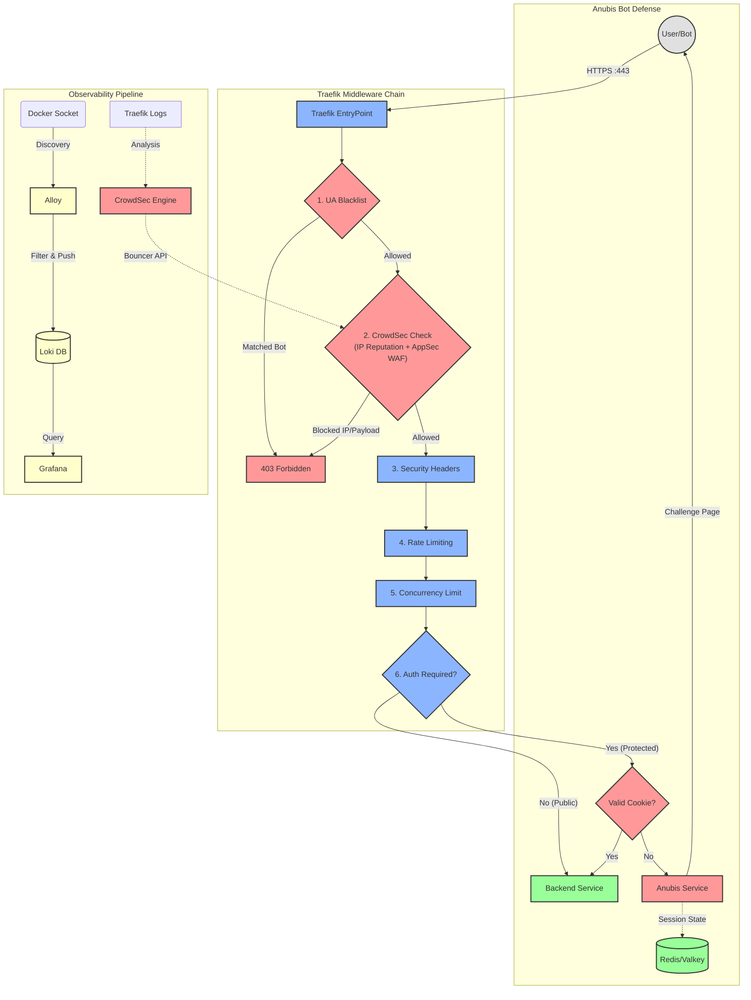

# Ironclad Anti-DDoS & Anti-Bot Stack

**Traefik + CrowdSec + Anubis + Grafana (LGT Stack)**

> **Automated, resource-efficient protection for multi-domain Docker environments and legacy web servers.**

---

## Table of Contents

- [Quick Start](#quick-start)
  - [Prerequisites](#prerequisites)
  - [Option A: Local Development](#option-a-local-development)
  - [Option B: Staging](#option-b-staging-recommended-first-deploy)
  - [Option C: Production](#option-c-production)
  - [First Steps After Setup](#first-steps-after-setup)
- [Architecture](#architecture)
  - [Traffic Flow](#traffic-flow)
  - [Key Benefits](#key-benefits)
- [Domain Management](#domain-management)
  - [The Domain Inventory (domains.csv)](#the-domain-inventory-domainscsv)
  - [Dashboard UI](#dashboard-ui)
  - [Adding Your First Site](#adding-your-first-site)
- [Configuration Reference](#configuration-reference)
  - [General](#general)
  - [Anubis (Bot Defense)](#anubis-bot-defense)
  - [Redis & Session Store](#redis--session-store)
  - [CrowdSec (IPS/WAF)](#crowdsec-ipswaf)
  - [Traefik (Edge Router)](#traefik-edge-router)
  - [Dashboard & SSO](#dashboard--sso)
  - [Observability (Prometheus)](#observability-prometheus)
  - [Watchdog Alerts](#watchdog-alerts-env)
- [Components (Technical Deep Dive)](#components-technical-deep-dive)
  - [Traefik — Edge Router](#traefik--edge-router)
  - [CrowdSec — IPS + WAF](#crowdsec--ips--waf)
  - [Anubis — Bot Defense](#anubis--bot-defense)
  - [Redis / Valkey — Session Store](#redis--valkey--session-store)
  - [Dashboard — Admin UI](#dashboard--admin-ui)
  - [Observability Stack](#observability-stack)
  - [Watchdog — Stack Monitor](#watchdog--stack-monitor)
  - [Auxiliary Tools](#auxiliary-tools)
- [Operations Manual](#operations-manual)
  - [Common Commands](#common-commands)
  - [Security First Boot Sequence](#security-first-boot-sequence)
  - [Smart Credentials & Auto-Sync](#smart-credentials--auto-sync)
  - [Grafana Alerting](#grafana-alerting)
  - [CrowdSec Operations](#crowdsec-operations)
  - [Monitoring Dashboards](#monitoring-dashboards)
  - [Watchdog Notifications](#watchdog-notifications)
- [Apache Legacy Configuration](#apache-legacy-configuration)
- [Trusted Local SSL (mkcert)](#trusted-local-ssl-mkcert)
- [Project Structure](#project-structure)
- [Troubleshooting](#troubleshooting)
- [License](#license)

---

## Quick Start

Get the stack running in minutes. Choose the environment that matches your needs.

### Prerequisites

- **Docker Engine** & **Docker Compose** (v2.x+)
- **Make** (usually pre-installed, or via `build-essential`)
- **Python 3** (modules are auto-installed via virtual environment):
  ```bash
  # Debian/Ubuntu
  sudo apt install make python3-venv python3-pip

  # RHEL/Fedora
  sudo dnf install make python3-pip
  ```
- Ports `80` and `443` free on the host machine.
- **Kernel memory overcommit enabled** (required by Redis/Valkey):
  ```bash
  echo 'vm.overcommit_memory = 1' | sudo tee -a /etc/sysctl.conf
  sudo sysctl vm.overcommit_memory=1
  ```
  > Without this, Redis may fail background saves under memory pressure. See [Troubleshooting → Redis Memory Overcommit Warning](#redis-memory-overcommit-warning) for details.

---

### Option A: Local Development

Best for testing on your machine with `.local` domains and browser-trusted certificates.

```bash
# 1. Install mkcert (one-time setup)
# Debian/Ubuntu:
sudo apt install mkcert
# macOS:
brew install mkcert

mkcert -install   # Adds the local CA to your system trust store

# 2. Add your test domains to /etc/hosts
echo "127.0.0.1 myapp.local auth.myapp.local" | sudo tee -a /etc/hosts

# 3. Initialize the environment (interactive wizard)
make init
# When prompted for environment, choose: local

# 4. Start the stack
make start
```

> [!TIP]
> The stack automatically reads `/etc/hosts` and generates a single trusted certificate covering all domains pointing to `127.0.0.1`. No manual cert work needed.

---

### Option B: Staging (Recommended First Deploy)

Uses Let's Encrypt **staging** certificates. Safe for testing without hitting production rate limits.

```bash
# 1. Point your domain's DNS A record to this server's public IP

# 2. Initialize the environment
make init
# When prompted for environment, choose: staging

# 3. Start the stack
make start
```

> [!WARNING]
> Staging certificates trigger browser "Not Secure" warnings — this is expected. Validate everything works, then switch to `production`.

---

### Option C: Production

Uses real Let's Encrypt certificates. **Only use after a successful staging test.**

```bash
# 1. Ensure DNS is correctly configured and staging worked successfully

# 2. Edit .env and change the environment type:
TRAEFIK_ACME_ENV_TYPE=production

# 3. Clear old staging certificates (backs up acme.json automatically)
make clean

# 4. Restart the full stack to request new production certificates
make restart
```

> [!IMPORTANT]
> Let's Encrypt production has strict rate limits. Never go straight to production without a successful staging test first.

---

### First Steps After Setup

All internal tools are accessible from your dashboard subdomain (default: `dashboard.<your-domain>`):

1. **Access Dashboard**: `https://dashboard.<your-domain>` — Add and manage your sites here.
2. **View Traefik Dashboard**: `https://dashboard.<your-domain>/traefik` — Live routing overview.
3. **View Live Logs**: `https://dashboard.<your-domain>/dozzle` — Real-time container logs.
4. **Monitor Metrics**: `https://dashboard.<your-domain>/grafana` — Traffic and system dashboards.
5. **View Certificates**: `https://dashboard.<your-domain>/certs` — Certificate status per domain.
6. **Manage Firewall**: `https://dashboard.<your-domain>/crowdsec` — CrowdSec alert management.

> [!NOTE]
> The `dashboard` subdomain is configurable via `DASHBOARD_SUBDOMAIN` in `.env`. All tools behind it share a single SSO login — the Dashboard credentials.

---

## Architecture

The stack operates on a **"Defense in Depth"** principle, filtering traffic through a sequential middleware chain before it ever reaches your applications.

### Traffic Flow



### Key Benefits

| Feature | Description |
|---------|-------------|
| 🛡️ **Multi-Layered Defense** | IP reputation (CrowdSec), payload inspection (AppSec WAF), PoW bot challenge (Anubis), rate limiting, and UA blocklists all in sequence. |
| ⚡ **Performance First** | Optimized middleware chain designed for minimal latency; Redis caching eliminates repeated lookups. |
| 🤖 **Fully Automated** | Configuration generated dynamically from running containers and a simple CSV file. No manual Traefik YAML editing needed. |
| 📊 **Complete Visibility** | Full observability stack: Grafana dashboards, Loki log aggregation, Prometheus metrics, and Telegram alerting. |
| 🏠 **Hybrid Ready** | Protects Docker containers and legacy host-based services (Apache/PHP) simultaneously. |
| 🔐 **No-Hassle SSL** | Automated Let's Encrypt certificates for production/staging, or locally trusted certs for development (via mkcert). |

---

## Domain Management

Define which websites the stack will protect and how each should behave.

### The Domain Inventory (`domains.csv`)

The heart of the configuration. Manage it manually or via the web UI.

| Column | Description | Mandatory |
|:---|:---|:---:|
| **domain** | Full domain name (e.g., `shop.example.com`). | ✅ |
| **redirection** | Target URL if this domain should redirect (e.g., `www.example.com`). Leave empty for no redirect. | ❌ |
| **service** | Docker service name (must match `container_name` or the service key in compose) or `apache-host` for legacy servers. | ✅ |
| **anubis_sub** | Subdomain to use as the Anubis PoW authentication portal (e.g., `auth`). Leave empty to disable bot protection for this domain. | ❌ |
| **rate_limit** | Override the global average requests/sec for this domain. | ❌ |
| **burst** | Override the global peak request burst for this domain. | ❌ |
| **concurrency** | Override the global max simultaneous connections for this domain. | ❌ |

**Example `domains.csv`:**

```csv
# domain,             redirection,     service,       anubis_sub,  rate, burst, concurrency

# Protected site with Anubis, custom rate limits
myshop.com,           ,                myshop-app,    auth,        50,   100,   20
www.myshop.com,       myshop.com,      myshop-app,    auth,        50,   100,   20

# Blog: no bot protection, global rate limits
blog.com,             ,                blog-app,      ,            ,     ,
www.blog.com,         ,                blog-app,      ,            ,     ,

# Legacy site on host Apache
legacy-site.com,      ,                apache-host,   ,            ,     ,
```

> [!NOTE]
> Blank values for `rate_limit`, `burst`, and `concurrency` mean global defaults from `.env` are applied.

---

### Dashboard UI

Access the management interface at `https://dashboard.<your-domain>`.

- **Live Preview**: Shows which Docker containers are currently running and available.
- **Visual Grouping**: Domains are automatically grouped and color-coded by their root TLD.
- **Safe Defaults**: Enforces sensible defaults to prevent accidental misconfiguration.
- **Restart Stack**: Has a built-in "Restart Stack" button that calls `start.sh` from inside the container, applying changes without needing SSH access.

---

### Adding Your First Site

1. Open the Dashboard UI or edit `domains.csv` directly.
2. Add a row for your domain, pointing `service` to your Docker container name.
3. Ensure your container is on the `traefik` Docker network:
   ```yaml
   # In your application's docker-compose.yml:
   networks:
     - traefik
   networks:
     traefik:
       external: true
   ```
4. Run `make start` (or click "Restart Stack" in the UI) to apply changes.

---

## Configuration Reference

All configuration is managed through the `.env` file. Copy `.env.dist` to `.env` and fill in your values.

> [!TIP]
> Run `make init` for an interactive wizard that guides you through the required settings. Run `make validate` at any time to check your `.env` for errors.

---

### General

| Variable | Description | Default |
|----------|-------------|---------|
| `DOMAIN` | Your primary base domain. Used for all dashboard subdomains and watchdog alerts. **Required.** | — |
| `PROJECT_NAME` | Prefix for all Docker container names (e.g., `stack-traefik-1`). Prevents conflicts if running multiple stacks. | `stack` |
| `TZ` | Server timezone for logs, dashboards, and scheduled tasks. | `Europe/Madrid` |

---

### Anubis (Bot Defense)

| Variable | Description | Default |
|----------|-------------|---------|
| `ANUBIS_DIFFICULTY` | Complexity of the Proof-of-Work challenge (scale of 1–5). Higher values require more client CPU. See [Anubis — Bot Defense](#anubis--bot-defense) for implications. | `4` |
| `ANUBIS_REDIS_PRIVATE_KEY` | Hex key used to sign Anubis session cookies. Auto-generated on first `make init`. **Do not share or commit.** | *Auto-generated* |
| `ANUBIS_CPU_LIMIT` | CPU limit (in cores) per Anubis instance. Prevents a single instance from starving the host under a bot flood. | `0.10` |
| `ANUBIS_MEM_LIMIT` | Memory limit per Anubis instance. | `32M` |

**Choosing the right difficulty:**

| Value | Client impact | Recommended for |
|-------|--------------|-----------------|
| `1–2` | Near-instant solve (<1s) | Testing, low-traffic sites |
| `3–4` | Moderate (1–3s on modern hardware) | Most production sites (default) |
| `5`   | Noticeable delay (3–10s+) | High-value targets under active bot attack |

> [!NOTE]
> Legitimate browsers running JavaScript solve the challenge transparently in the background. Real users only see a brief loading screen. The challenge is designed to be invisible for normal users, but computationally expensive at scale for bots.

---

### Redis & Session Store

| Variable | Description | Default |
|----------|-------------|---------|
| `REDIS_PASSWORD` | Password for the Redis/Valkey instance. Shared between Anubis (session state) and CrowdSec (ban cache). Auto-generated on first `make init`. | *Auto-generated* |

Redis uses two separate databases:

- **DB 0**: Reserved for CrowdSec's ban decision cache.
- **DB 1**: Used by Anubis for PoW session tokens.

> [!CAUTION]
> Changing `REDIS_PASSWORD` after initial setup invalidates all existing Anubis sessions and CrowdSec cached decisions. Users will need to re-solve the PoW challenge, and CrowdSec will need to re-download the blocklist from LAPI.

---

### CrowdSec (IPS/WAF)

| Variable | Description | Default |
|----------|-------------|---------|
| `CROWDSEC_ENABLE` | Master switch. Set to `false` to completely disable the IPS/WAF (useful for debugging). When disabled, CrowdSec and its bouncer are not started. | `true` |
| `CROWDSEC_API_KEY` | Shared secret for Traefik-to-CrowdSec bouncer communication. Auto-generated on first `make init`. | *Auto-generated* |
| `CROWDSEC_UPDATE_INTERVAL` | How often (seconds) the Traefik bouncer downloads the active blocklist from the CrowdSec LAPI. Lower = more CPU/network overhead, faster enforcement of new bans. | `60` |
| `CROWDSEC_APPSEC_ENABLE` | Enable the AppSec WAF component (Layer 7 payload inspection). When enabled, AppSec collections are automatically added to `CROWDSEC_COLLECTIONS`. | `true` |
| `CROWDSEC_COLLECTIONS` | Space-separated list of CrowdSec collections (parsers + scenarios) to install at startup. AppSec collections are injected automatically — do not add them here. | *defaults below* |
| `CROWDSEC_WHITELIST_IPS` | Comma-separated IPs or CIDR ranges that bypass all CrowdSec checks. Internal Docker networks are always whitelisted automatically. | — |
| `CROWDSEC_ENROLLMENT_KEY` | Optional key to enroll in the [CrowdSec Console](https://app.crowdsec.net) for centralized management and premium blocklists. | — |

**Default collections included in `CROWDSEC_COLLECTIONS`:**

```
crowdsecurity/traefik
crowdsecurity/http-cve
crowdsecurity/sshd
crowdsecurity/whitelist-good-actors
crowdsecurity/base-http-scenarios
crowdsecurity/http-dos
```

When `CROWDSEC_APPSEC_ENABLE=true`, these are automatically added at startup:
```
crowdsecurity/appsec-virtual-patching
crowdsecurity/appsec-generic-rules
```

> [!TIP]
> If you're getting too many false positives (legitimate traffic being flagged), try removing `crowdsecurity/http-dos` from `CROWDSEC_COLLECTIONS` first — it is the most aggressive collection.

#### Fail-Open Behavior (High Availability)

The stack is configured for **Fail Open** by default: if CrowdSec LAPI, AppSec, or Redis become temporarily unreachable, the Traefik bouncer plugin will **not** block legitimate traffic. It simply passes requests through, relying on rate-limiting and Anubis as fallbacks.

This is controlled by these plugin settings (auto-generated in `traefik-generated.yaml`):

| Setting | Value | Meaning |
|---------|-------|---------|
| `updateMaxFailure` | `-1` | Infinite retries on LAPI failure; never give up. |
| `redisCacheUnreachableBlock` | `false` | Don't block if Redis is down. |
| `crowdsecAppsecFailureBlock` | `false` | Don't block if AppSec engine errors. |
| `crowdsecAppsecUnreachableBlock` | `false` | Don't block if AppSec is temporarily unreachable. |

> [!IMPORTANT]
> If you prefer a **Fail Closed** posture (block everything when security is degraded), you would need to change these values in `config/traefik/traefik.yaml.template`. This is intentionally not exposed as an env variable because it is a significant security posture change.

---

### Traefik (Edge Router)

#### Network & SSL

| Variable | Description | Default |
|----------|-------------|---------|
| `TRAEFIK_LISTEN_IP` | Host IP to bind ports 80 and 443. Use `0.0.0.0` to listen on all interfaces. Useful to restrict to a specific interface (e.g., a private LAN IP). | `0.0.0.0` |
| `TRAEFIK_ACME_EMAIL` | Email for Let's Encrypt expiry notifications. Required for staging/production. | — |
| `TRAEFIK_ACME_ENV_TYPE` | Certificate environment: `production` (real certs), `staging` (test certs, no rate limits), or `local` (mkcert, no ACME). | `staging` |
| `TRAEFIK_ACME_CA_SERVER` | Direct override of the ACME CA URL. Only used when `TRAEFIK_ACME_ENV_TYPE` is left empty. Useful for alternative ACME providers (e.g., ZeroSSL). | — |

#### Rate Limiting & Concurrency

These are **global defaults**. Per-domain overrides can be set in `domains.csv`.

| Variable | Description | Default |
|----------|-------------|---------|
| `TRAEFIK_GLOBAL_RATE_AVG` | Average requests per second allowed per source IP. | `60` |
| `TRAEFIK_GLOBAL_RATE_BURST` | Peak requests allowed in a burst before throttling kicks in. | `120` |
| `TRAEFIK_GLOBAL_CONCURRENCY` | Maximum simultaneous in-flight connections per source IP. | `25` |

**Rate limiting vs. Concurrency — what's the difference?**

- **Rate limiting** (`RATE_AVG`/`BURST`): Controls the *frequency* of requests over time. A client sending 200 requests in a second will be throttled after `BURST`.
- **Concurrency** (`CONCURRENCY`): Controls *simultaneous* active requests. A single client holding 30 open slow-upload connections will be throttled after `CONCURRENCY`, regardless of rate.

Both are enforced per source IP. They complement each other: rate limiting stops floods, concurrency stops Slowloris-style attacks.

#### Security Headers & HSTS

| Variable | Description | Default |
|----------|-------------|---------|
| `TRAEFIK_HSTS_MAX_AGE` | HSTS header max-age in seconds. Tells browsers to always use HTTPS for this domain. | `31536000` (1 year) |
| `TRAEFIK_FRAME_ANCESTORS` | Comma-separated external origins allowed to embed your sites in iframes. If empty, `SAMEORIGIN` is enforced (no cross-origin iframes). | — |

> [!CAUTION]
> Once HSTS is set with a `max-age` of 1 year and browsers have visited, it cannot be undone quickly. Use a low value like `300` during initial testing and only increase to `31536000` once you're certain HTTPS is permanently configured.

**HSTS testing workflow:**
```bash
# In .env, start with:
TRAEFIK_HSTS_MAX_AGE=300

# After confirming everything works:
TRAEFIK_HSTS_MAX_AGE=31536000
```

#### Blocking & Filtering

| Variable | Description | Default |
|----------|-------------|---------|
| `TRAEFIK_BLOCKED_PATHS` | Comma-separated path prefixes to block globally with a 403. Supports regex (Go syntax). Example: `/wp-admin,/xmlrpc.php,/.env`. | — |
| `TRAEFIK_BAD_USER_AGENTS` | Comma-separated regex patterns to match against the `User-Agent` header. Matching requests are blocked at the router level (native Traefik, before any middleware). Example: `(?i).*curl.*,(?i).*python-requests.*`. | — |
| `TRAEFIK_GOOD_USER_AGENTS` | Comma-separated regex patterns for User-Agents that bypass CrowdSec and the blocklist (e.g., trusted internal tools). | — |

> [!NOTE]
> `TRAEFIK_BAD_USER_AGENTS` blocking operates via a dedicated high-priority router in Traefik — it runs **before** the middleware chain. This makes it extremely efficient and useful for immediately dropping known bad bots without any security engine overhead.

**Example: Blocking common vulnerability scanners:**
```bash
TRAEFIK_BAD_USER_AGENTS="(?i).*nikto.*,(?i).*sqlmap.*,(?i).*nmap.*,(?i).*masscan.*"
```

#### Timeouts

| Variable | Default | Controls |
|----------|---------|----------|
| `TRAEFIK_TIMEOUT_ACTIVE` | `60` | `readTimeout`, `writeTimeout` (EntryPoints) + `responseHeaderTimeout` (Transport). Maximum time allowed for the full request/response cycle or for headers to arrive. |
| `TRAEFIK_TIMEOUT_IDLE` | `90` | `idleTimeout` (EntryPoints) + `idleConnTimeout` (Transport). How long idle keep-alive connections are maintained. Should always be **higher** than `TRAEFIK_TIMEOUT_ACTIVE`. |

> [!IMPORTANT]
> These settings apply at **both ends** of the proxy (client-to-Traefik and Traefik-to-backend). If your application (e.g., a heavy WordPress page or a long-running PHP script) takes more than 60 seconds to respond, increase `TRAEFIK_TIMEOUT_ACTIVE` accordingly. Example for legacy PHP: `TRAEFIK_TIMEOUT_ACTIVE=120`.

#### Logging

| Variable | Description | Default |
|----------|-------------|---------|
| `TRAEFIK_ACCESS_LOG_BUFFER` | Number of log lines to buffer in memory before writing to disk. Higher values reduce I/O at the cost of delayed log visibility. | `1000` |
| `TRAEFIK_LOG_LEVEL` | Traefik internal log verbosity. Options: `DEBUG`, `INFO`, `WARN`, `ERROR`, `FATAL`. | `INFO` |

**When to change log settings:**

| Scenario | Recommended settings |
|----------|---------------------|
| Production | `TRAEFIK_ACCESS_LOG_BUFFER=1000`, `TRAEFIK_LOG_LEVEL=INFO` |
| Debugging UA/path blocks | `TRAEFIK_ACCESS_LOG_BUFFER=1` (instant log visibility) |
| Debugging certificate issuance | `TRAEFIK_LOG_LEVEL=DEBUG` + `make certs-watch` |

#### Apache Legacy

| Variable | Description | Default |
|----------|-------------|---------|
| `APACHE_HOST_IP` | IP address of the host machine as seen from inside Docker containers. On Linux with the default Docker bridge, this is the `docker0` gateway. | `172.17.0.1` |
| `APACHE_HOST_PORT` | Port where an Apache instance is listening on the host. The stack probes this port at startup to auto-detect Apache. | `8080` |

> [!TIP]
> On **Docker Desktop** (macOS/Windows), set `APACHE_HOST_IP=host.docker.internal` since the `docker0` bridge does not exist on those platforms.

---

### Dashboard & SSO

| Variable | Description | Default |
|----------|-------------|---------|
| `DASHBOARD_SUBDOMAIN` | Subdomain prefix for all internal tools. Example: `dashboard` → `dashboard.yourdomain.com`. | `dashboard` |
| `DASHBOARD_ADMIN_USER` | Username for the Dashboard / SSO login (also used to access Traefik, Dozzle, Grafana). | `admin` |
| `DASHBOARD_ADMIN_PASSWORD` | Password for the SSO login. **Required.** Change from default before first use. | — |
| `GRAFANA_ADMIN_USER` | Grafana-specific admin username for full admin access inside Grafana. | `admin` |
| `GRAFANA_ADMIN_PASSWORD` | Grafana-specific admin password. Independent from SSO credentials. **Required.** | — |

**Access levels explained:**

- **SSO (Dashboard credentials)**: Grants **read-only Viewer** access to Grafana. Sufficient for viewing dashboards.
- **Grafana admin credentials**: Grants **full admin access** to Grafana for adding datasources, editing dashboards, and managing users.

> [!NOTE]
> Variables like `TRAEFIK_CERT_RESOLVER`, `TRAEFIK_CONFIG_HASH`, `DASHBOARD_SECRET_KEY`, `DASHBOARD_APP_PATH_HOST`, `TRAEFIK_DASHBOARD_AUTH`, and `DOZZLE_DASHBOARD_AUTH` are managed automatically by `start.sh`. **Do not edit them manually.**

---

### Observability (Prometheus)

| Variable | Description | Default |
|----------|-------------|---------|
| `PROMETHEUS_RETENTION_DAYS` | How many days of metrics data Prometheus keeps on disk. Older data is automatically purged. | `15` |
| `PROMETHEUS_MEM_LIMIT` | Memory limit for the Prometheus container. Increase if you have high cardinality metrics or a long retention period. | `512M` |

> [!TIP]
> For a single-server setup with default collections, `15d` retention and `512M` is more than enough. If you add custom metrics or increase retention significantly, bump `PROMETHEUS_MEM_LIMIT` to `1G` or more.

---

### Watchdog Alerts (env)

| Variable | Description | Default |
|----------|-------------|---------|
| `WATCHDOG_TELEGRAM_BOT_TOKEN` | Bot token from [@BotFather](https://t.me/botfather). Required to enable alerts. | — |
| `WATCHDOG_TELEGRAM_RECIPIENT_ID` | Telegram chat ID or group ID where alerts are sent. | — |
| `WATCHDOG_CERT_DAYS_WARNING` | Alert threshold: send warning when a certificate expires within this many days. | `10` |
| `WATCHDOG_DNS_CHECK_INTERVAL` | How often (seconds) to verify DNS records for all domains. | `21600` (6h) |
| `WATCHDOG_CROWDSEC_CHECK_INTERVAL` | How often (seconds) to check CrowdSec health and bouncer connectivity. | `3600` (1h) |

> [!TIP]
> Both `WATCHDOG_TELEGRAM_BOT_TOKEN` and `WATCHDOG_TELEGRAM_RECIPIENT_ID` are reused by Grafana Alerting automatically — no separate configuration needed for Grafana notifications.

**To get your Telegram chat ID:**
1. Send any message to your bot.
2. Visit: `https://api.telegram.org/bot<YOUR_BOT_TOKEN>/getUpdates`
3. Find `"chat": {"id": <number>}` in the response.

---

## Components (Technical Deep Dive)

### Traefik — Edge Router

Traefik (v3.x) is the ingress controller and the first active processing layer for all HTTP/HTTPS traffic.

#### Kernel Tuning

The Traefik container runs with custom kernel parameters for improved connection handling under high load:

```yaml
sysctls:
  net.core.somaxconn: 4096          # Max queued connections
  net.ipv4.tcp_max_syn_backlog: 4096 # SYN flood protection
  net.ipv4.tcp_syncookies: 1         # SYN cookies (anti-SYN-flood)
  net.ipv4.tcp_fin_timeout: 15       # Faster FIN_WAIT cleanup
  net.ipv4.tcp_tw_reuse: 1           # Reuse TIME_WAIT sockets
  net.ipv4.tcp_keepalive_time: 60    # Keep-alive probes at 60s
```

#### The Golden Chain (Middleware Pipeline)

Every request passes through this sequential chain:

| Order | Middleware | Purpose | Security Benefit |
|:---:|:---|:---|:---|
| 1 | **CrowdSec Check** | Consults the local CrowdSec LAPI for the client IP, and forwards the request payload to AppSec for inspection. | Instant block for known malicious IPs; WAF inspection for exploit payloads. |
| 2 | **Global Buffering** | Reads the entire request body into memory before forwarding. | **Slowloris Defense**: prevents attackers from holding sockets open indefinitely with slow upload streams. |
| 3 | **Security Headers** | Injects `Strict-Transport-Security`, `X-Content-Type-Options`, `X-Frame-Options`, `X-XSS-Protection`, `Content-Security-Policy`. | Client-side hardening against clickjacking, protocol downgrade, and MIME sniffing. |
| 4 | **Rate Limiting** | Throttles requests per source IP based on `TRAEFIK_GLOBAL_RATE_AVG` and `TRAEFIK_GLOBAL_RATE_BURST`. | Mitigates automated scraping and brute-force attacks. |
| 5 | **Concurrency Limit** | Caps simultaneous active connections per source IP (`TRAEFIK_GLOBAL_CONCURRENCY`). | Prevents one client from consuming all backend threads. |
| 6 | **ForwardAuth (Anubis)** | (Optional, per-domain) Intercepts and challenges sessions without cookies. | Forces bots to solve a PoW challenge; transparent for real browsers. |
| 7 | **Compression** | Dynamically compresses responses (Gzip) for supportive clients. | Reduces bandwidth; improves load times. |

> [!NOTE]
> The **UA Blacklist** operates separately via a high-priority dedicated router, running **before** this chain. It is the most efficient block layer.

#### Specialized Middlewares

- **`apache-forward-headers`**: Injects `X-Forwarded-Proto: https` and `X-Forwarded-For` headers. Critical for legacy PHP/WordPress to detect HTTPS correctly.
- **`redirect-regex`**: Handles 301/302 redirections defined in `domains.csv` with compiled regex matching.
- **`anubis-assets-stripper`**: Cleans internal Anubis asset request paths before forwarding to the Nginx static server.

#### Dynamic Configuration

Traefik's dynamic configuration (routers, middlewares, services) is entirely generated by `scripts/generate-config.py` from `domains.csv`. This Python script:
- Reads `domains.csv` and currently running Docker containers.
- Generates per-domain router and middleware YAML files in `config/traefik/dynamic-config/`.
- Traefik hot-reloads these files without downtime.

---

### CrowdSec — IPS + WAF

CrowdSec is a collaborative security engine combining behavioral **Intrusion Prevention** with a **Web Application Firewall**.

#### Architecture Overview

```
┌─────────────────────────────────────────────────────────────┐
│                      CrowdSec Engine                        │
├─────────────────────────────────────────────────────────────┤
│  Parsers          │  Scenarios         │  LAPI (REST API)   │
│  ├─ traefik       │  ├─ http-probing   │  ├─ Decisions DB   │
│  ├─ syslog (sftp) │  ├─ http-crawlers  │  ├─ Bouncer API    │
│  └─ ...           │  └─ brute-force    │  └─ Central API    │
└─────────────────────────────────────────────────────────────┘
         ▲                    │                    │
         │ Logs               │ Alerts             ▼
    ┌────┴────┐          ┌────┴────┐       ┌──────────────┐
    │ Traefik │          │ Console │       │   Bouncer    │
    │  Logs   │          │(Optional)       │  (Traefik)   │
    └─────────┘          └─────────┘       └──────────────┘
```

#### Key Concepts

| Concept | Description |
|---------|-------------|
| **Parser** | Extracts structured fields (IP, user-agent, status, path) from raw logs. |
| **Scenario** | Defines a pattern of malicious behavior (e.g., "10 failed logins from the same IP in 1 minute"). |
| **Decision** | The remediation action (ban, captcha, throttle) with a duration attached to it. |
| **Bouncer** | Component that receives and enforces decisions. In this stack: the Traefik plugin. |
| **LAPI** | Local API: the central database of decisions, communicating with bouncers and the Central API. |
| **CAPI** | Central API: the CrowdSec cloud service that aggregates threat data from all community instances. |

#### Installed Collections

| Collection | Layer | Description |
|------------|:---:|-------------|
| `crowdsecurity/traefik` | L3/L4 | Parsers and scenarios for Traefik access logs |
| `crowdsecurity/http-cve` | L3/L4 | Detection of CVE exploit probes in HTTP traffic |
| `crowdsecurity/sshd` | L3/L4 | SSH brute-force detection (for SFTP sidecar) |
| `crowdsecurity/whitelist-good-actors` | L3/L4 | Whitelists legitimate crawlers (Google, Bing, DuckDuckGo) |
| `crowdsecurity/base-http-scenarios` | L3/L4 | Common HTTP attacks: path traversal, SQL injection probes |
| `crowdsecurity/http-dos` | L3/L4 | HTTP flood and DDoS pattern detection |
| `crowdsecurity/appsec-virtual-patching` | **L7 (WAF)** | Virtual patches for known CVEs — blocks exploitation before you can patch |
| `crowdsecurity/appsec-generic-rules` | **L7 (WAF)** | OWASP Top 10 rules: SQLi, XSS, LFI, RCE, SSTI, path traversal |

#### AppSec (Web Application Firewall)

The AppSec component inspects HTTP request payloads in real time. The Traefik bouncer plugin forwards each request to the AppSec engine (on port `7422`, internal network only) before passing it to the backend.

```
                     ┌─────────────────────────────────┐
  HTTP Request ──▶   │  Traefik Bouncer Plugin          │
                     │  1. IP check (LAPI stream cache)  │
                     │  2. Payload check (AppSec :7422) ─┼──▶ CrowdSec AppSec Engine
                     └──────────────────────────────────┘           │
                               │ Block (403) or Allow                │ 184+ inband rules
                               ▼                                     │ (vpatch + generic)
                          Backend Service  ◀── Allow ────────────────┘
```

The AppSec engine runs **fail-open**: if it is temporarily unreachable (e.g., during a restart), Traefik continues serving traffic normally. Rate-limiting and Anubis remain active as a fallback.

#### Aggressive Ban Policy

Custom profiles in `config/crowdsec/profiles.yaml` enforce longer ban durations than defaults:

| Profile | Trigger | Ban Duration | CrowdSec Default |
|---------|---------|:---:|:---:|
| `repeat_offender` | IP triggers > 5 events | **7 days** | N/A |
| `aggressive_ban` | Any single IP-based alert | **24 hours** | 4 hours |
| `range_ban` | Subnet-based alert | **48 hours** | N/A |

Profile order matters: the first matching profile wins. Repeat offenders are caught first.

> [!TIP]
> Edit `config/crowdsec/profiles.yaml` to tune ban durations. A restart of CrowdSec (`make restart crowdsec`) is required to apply changes.

#### CAPTCHA Remediation

Instead of directly blocking suspicious IPs for HTTP-based scenarios (e.g., crawlers or minor bot activity), CrowdSec can present a CAPTCHA challenge (via Turnstile, hCaptcha, or reCAPTCHA).

- If the user solves the challenge, their IP is temporarily cleared for a grace period of 3600 seconds (1 hour).
- If they fail or are an automated bot, they remain blocked.
- AppSec rules (WAF) always issue an immediate hard **ban** to prevent exploitation, skipping the CAPTCHA entirely.

> [!NOTE]
> The CAPTCHA remediation profile is generated dynamically. It is enabled on a per-root-domain basis by registering the provider, site key, and secret key in the CAPTCHA Keys section of the Dashboard. If no active keys are registered for a root domain, the stack gracefully falls back to aggressive bans for all services on that domain.

> [!WARNING]
> If using Cloudflare Turnstile, ensure **all domains** served by Traefik on a registered root domain are allowed in the Turnstile widget configuration. If a domain is missing, the CAPTCHA will fail to load for that site, resulting in an un-solvable challenge (effectively a hard ban) for any users flagged on that domain.

#### Log Acquisition (`acquis.yaml`)

CrowdSec reads logs from Docker container stdout/stderr via the Docker socket. The acquisition config (`config/crowdsec/acquis.yaml`) is auto-generated by `start.sh` from `acquis-base.yaml`:

- **Traefik logs** (`type: traefik`): Parsed for HTTP-based scenarios.
- **SFTP/sidecar logs** (`type: syslog`): Parsed for SSH brute-force scenarios.
- **AppSec listener** (auto-added when `CROWDSEC_APPSEC_ENABLE=true`): Listens on `:7422` for payload inspection.

#### CrowdSec Console (Optional)

Connect to the [CrowdSec Console](https://app.crowdsec.net) to get:
- Centralized view of alerts across multiple servers.
- Access to premium blocklists (not available in free tier).
- Visual attack trend dashboards.

To enable:
```bash
# In .env:
CROWDSEC_ENROLLMENT_KEY=your-key-from-app.crowdsec.net
# Then run make start and enrollment happens automatically.
```

---

### Anubis — Bot Defense

Anubis is a **ForwardAuth** service that gates access to protected domains behind a cryptographic Proof-of-Work challenge.

#### How It Works

1. User requests a protected route.
2. Traefik's ForwardAuth middleware asks Anubis: "Is this session valid?"
3. **If no valid cookie**: Anubis returns a challenge page. The browser runs JavaScript to compute a PoW hash.
4. **On success**: Anubis issues a signed, time-limited cookie. Subsequent requests pass instantly.
5. **Bots without JavaScript**: Cannot solve the challenge, never get access.

#### Bot Policy

The default `config/anubis/botPolicy.yaml` defines the challenge rules in priority order:

| Rule | Action | Description |
|------|--------|-------------|
| Docker clients | DENY | Blocks `Docker-*` user agents |
| Cloudflare Workers | DENY | Blocks requests with `CF-Worker` header |
| `/.well-known/*` | ALLOW | Let's Encrypt validation paths bypass the challenge |
| `/favicon.ico`, `/robots.txt` | ALLOW | Common static files bypass the challenge |
| SEO bots | ALLOW | Googlebot, Bingbot, etc. bypass the challenge |
| `Mozilla/*` | CHALLENGE | All regular browser user agents are challenged |

#### Deployment Model

One Anubis instance is deployed **per TLD** (root domain). This is intentional — `SameSite` cookie policies require that the auth cookie is issued from the same TLD as the protected site. Sharing a single Anubis instance across different root domains would cause cookie rejection.

The `anubis_sub` column in `domains.csv` defines the subdomain used for the Anubis portal (e.g., `auth` → `auth.example.com`).

#### Custom Assets

Customize the challenge page appearance by providing your own files:

| File | Location | Description |
|------|----------|-------------|
| `custom.css` | `config/anubis/assets/` | Custom stylesheet |
| `happy.webp` | `config/anubis/assets/static/img/` | Image shown on solved challenge |
| `pensive.webp` | `config/anubis/assets/static/img/` | Image shown while solving |
| `reject.webp` | `config/anubis/assets/static/img/` | Image shown on failed challenge |

`.dist` versions exist for all files. If no custom version is found, `start.sh` automatically copies the `.dist` version.

```bash
# Example: customize the challenge page
cp config/anubis/assets/custom.css.dist config/anubis/assets/custom.css
# Edit config/anubis/assets/custom.css to your liking

# Example: use your own images
cp /path/to/your-logo.webp config/anubis/assets/static/img/happy.webp
```

> Custom assets are git-ignored — they won't be overwritten by project updates.

---

### Redis / Valkey — Session Store

A [Valkey](https://valkey.io) (Redis-compatible) instance provides the shared session store.

- **Image**: `valkey/valkey:9.0` (Alpine-based, lightweight)
- **Eviction policy**: `allkeys-lru` — least recently used sessions are evicted when memory is full.
- **Persistence**: AOF (Append-Only File) with per-second sync — sessions survive container restarts.
- **Memory limit**: 256MB (configurable via Docker resource limits in the compose file).
- **Networks**: Connected to both `traefik` (accessed by CrowdSec) and `anubis-backend` (internal-only, accessed by Anubis instances).

The `anubis-backend` network is created as **Docker internal** (`--internal`), meaning Anubis containers have no direct internet access — they can only communicate with Redis.

---

### Dashboard — Admin UI

A lightweight Python/Flask web application that provides the web interface for managing `domains.csv`.

- **SSO Provider**: The Dashboard acts as the authentication backend for all dashboard tools. It issues session cookies that Traefik's ForwardAuth middleware validates.
- **Live Service Discovery**: Reads from the Docker socket to list running containers as available services.
- **Stack Restart**: Triggers `start.sh` from inside the container, applying changes without SSH access.
- **Environment visibility**: Exposes the stack's environment type (local/staging/production) to inform users about the certificate mode.
- **Host Apache detection**: Uses Python's `socket` module to probe `APACHE_HOST_IP:APACHE_HOST_PORT` and expose `apache-host` as an option only when Apache is actually listening.

---

### Observability Stack

The observability stack consists of four interconnected services:

#### Alloy (Log & Metrics Collector)

Grafana Alloy is an OpenTelemetry-compatible agent that:
- **Discovers** Docker containers automatically via the Docker socket.
- **Tails log files** from `/var/lib/docker/containers/` for all containers.
- **Forwards logs** to Loki, tagged with container labels.
- **Scrapes metrics** from Traefik, CrowdSec, Redis exporter, and itself.
- **Pushes metrics** to Prometheus via `remote_write`.
- **Collects host metrics** (CPU, RAM, disk, network) via a built-in Node Exporter-compatible module (mounts `/proc`, `/sys`, and `/`).

#### Loki (Log Storage)

Grafana Loki stores and indexes all container logs. Logs are queryable via **LogQL** in Grafana.

**Useful LogQL queries:**
```logql
# All Traefik access logs
{container="traefik"}

# Only 5xx errors
{container="traefik"} |= "\"5"

# CrowdSec alerts and bans
{container="crowdsec"} |= "ban"

# Apache host logs (when Apache integration is enabled)
{job="apache-host"}

# Apache 5xx errors
{job="apache-host", log_type="access"} | status =~ "5.."
```

#### Prometheus (Metrics Storage)

Prometheus stores time-series metrics. Receives data via `remote_write` from Alloy.

Key metrics collected:
- `traefik_*`: Request rates, error rates, latency percentiles, active connections.
- `crowdsec_*`: Active bans, decision rates, bouncer activity, WAF blocks.
- `redis_*`: Memory usage, hit rate, connected clients, commands/sec.
- `node_*`: CPU, RAM, disk I/O, network throughput, filesystem health.

#### Grafana (Visualization)

Four pre-provisioned dashboards are loaded automatically:

| Dashboard | Datasource | Key Panels |
|-----------|-----------|------------|
| **Traefik** | Prometheus | Request rates, error rates, latency P50/P95/P99, active connections |
| **CrowdSec** | Prometheus + Loki | Active bans, decision rates, bouncer activity, WAF blocks, live logs |
| **Redis** | Prometheus | Memory usage, hit rate, connected clients, commands/sec |
| **Node Exporter** | Prometheus | CPU, RAM, disk I/O, network, filesystem health |

**Access levels:**
- `https://dashboard.<domain>/grafana` — SSO login grants **read-only Viewer** access.
- Use `GRAFANA_ADMIN_USER` + `GRAFANA_ADMIN_PASSWORD` directly in Grafana for full admin access.

---

### Watchdog — Stack Monitor

A lightweight Alpine-based service that runs three monitoring scripts in parallel:

| Script | Interval | What it checks | Alert sent when |
|--------|----------|---------------|-----------------|
| `check-certs.sh` | 24 hours | Reads `acme.json` and checks expiry of all certificates | Any cert expires within `WATCHDOG_CERT_DAYS_WARNING` days |
| `check-dns.sh` | `WATCHDOG_DNS_CHECK_INTERVAL` | Resolves all domains from `domains.csv` | A domain does not resolve to `TRAEFIK_LISTEN_IP` |
| `check-crowdsec.sh` | `WATCHDOG_CROWDSEC_CHECK_INTERVAL` | CrowdSec container health, LAPI status, bouncer registration | LAPI unreachable, no bouncers registered, or bouncer errors |

All alerts are sent via the Telegram Bot API to `WATCHDOG_TELEGRAM_RECIPIENT_ID`.

---

### Auxiliary Tools

| Service | Description | Access |
|---------|-------------|--------|
| **Dozzle** | Real-time log viewer for all running containers | `https://dashboard.<domain>/dozzle` |
| **CrowdSec Web UI** | Web interface for the CrowdSec LAPI to manage alerts | `https://dashboard.<domain>/crowdsec` |
| **ctop** | Interactive container monitoring (CPU, RAM, net I/O) | `make ctop` |
| **Anubis-Assets** | Nginx server that serves Anubis static assets (CSS, images) | Internal, via Traefik dynamic config |
| **Redis Exporter** | Prometheus exporter for Redis metrics | Internal, scraped by Alloy |

---

## Operations Manual

### Common Commands

| Action | Command |
|--------|---------|
| **Initialize environment** | `make init` |
| **Start / update stack** | `make start` |
| **Stop stack** | `make stop` |
| **Restart full stack** | `make restart` |
| **Restart single service** | `make restart traefik` |
| **Rebuild custom images** | `make rebuild` (dashboard + watchdog) |
| **Rebuild specific service** | `make rebuild dashboard` |
| **Pull latest images** | `make pull` |
| **List services** | `make services` |
| **Container status** | `make status` |
| **Monitor containers** | `make ctop` |
| **Follow all logs** | `make logs` |
| **Follow service logs** | `make logs traefik` |
| **Open shell in container** | `make shell crowdsec` |
| **Validate environment** | `make validate` |
| **Sync .env with .env.dist** | `make sync` |
| **Clean generated configs** | `make clean` *(interactive, asks for confirmation)* |
| **Show all commands** | `make help` |

---

### Certificate Commands

| Action | Command |
|--------|---------|
| **Watch ACME logs** | `make certs-watch` *(requires `TRAEFIK_LOG_LEVEL=DEBUG`)* |
| **Certificate summary** | `make certs-info` |
| **Detailed certificate info** | `make certs-inspect` |
| **Generate local certs** | `make certs-create-local` *(local mode only)* |

---

### Security First Boot Sequence

When you run `make start`, `scripts/start.sh` follows a strict "Defense First" order:

1. **[1/6] Environment sync**: validates `.env`, merges any new variables from `.env.dist`.
2. **[2/6] Credential sync**: generates or verifies `DASHBOARD_SECRET_KEY`, `TRAEFIK_CERT_RESOLVER`, and any auto-generated secrets.
3. **[3/6] Asset preparation**: copies `.dist` Anubis assets if no custom versions exist; generates `traefik-generated.yaml` from template; runs `generate-config.py` to build dynamic Traefik config.
4. **[4/6] Network & security prep**: creates Docker networks (`traefik`, `anubis-backend`); generates CrowdSec IP whitelist from `CROWDSEC_WHITELIST_IPS`; probes for host Apache.
5. **[5/6] Security layer boot**: starts CrowdSec and Redis first. Waits up to 60 seconds for CrowdSec to pass its health check. **Traefik will not start until this is healthy.**
6. **[6/6] Full stack start**: launches all remaining services (Traefik, Grafana, Loki, Alloy, Prometheus, dashboard, watchdog, Dozzle). Then calls `grafana-setup-telegram` to configure alerting.

---

### Smart Credentials & Auto-Sync

You never need to manually generate bcrypt hashes or restart containers to apply credential changes.

1. **Edit** `DASHBOARD_ADMIN_PASSWORD` or `GRAFANA_ADMIN_PASSWORD` in `.env`.
2. **Run** `make start` (or `make restart`).
3. `start.sh` detects the changed values, regenerates the secure hashes, updates `.env`, and applies them to running containers.

If `.env` gets corrupted, delete the `*_CREDS_SYNC` variables and any `*_DASHBOARD_AUTH` values, then run `make start` — they will be regenerated.

---

### Grafana Alerting

Grafana Alerting sends Telegram notifications for infrastructure and performance events, evaluated directly from Prometheus metrics.

#### Pre-configured Alert Rules

14 rules in 4 groups, provisioned from `config/grafana/provisioning/alerting/rules.yaml`:

| Group | Alert | Condition | Duration | Severity |
|-------|-------|-----------|----------|----------|
| Infrastructure | `TraefikDown` | `up{job="traefik"} == 0` | 1m | 🔴 critical |
| Infrastructure | `CrowdSecDown` | `up{job="crowdsec"} == 0` | 1m | 🔴 critical |
| Infrastructure | `RedisDown` | `up{job="redis"} == 0` | 1m | 🟡 warning |
| Infrastructure | `NodeExporterDown` | `up{job="node_exporter"} == 0` | 2m | 🟡 warning |
| Traefik HTTP | `HighErrorRate` | > 5% 5xx requests over 5m | 5m | 🟡 warning |
| Traefik HTTP | `HighLatencyP50` | P50 latency > 2s on any service | 5m | 🟡 warning |
| Traefik HTTP | `TraefikConfigReloadFailure` | Any failed reload event | 1m | 🟡 warning |
| Host Resources | `HighMemoryUsage` | RAM > 90% | 5m | 🟡 warning |
| Host Resources | `CriticalMemoryUsage` | RAM > 97% | 2m | 🔴 critical |
| Host Resources | `HighCPULoad` | CPU > 85% | 10m | 🟡 warning |
| Host Resources | `DiskSpaceLow` | Disk free < 15% | 5m | 🟡 warning |
| Host Resources | `DiskSpaceCritical` | Disk free < 5% | 2m | 🔴 critical |
| Redis | `RedisHighMemoryUsage` | > 85% of `maxmemory` | 5m | 🟡 warning |
| Redis | `RedisRejectedConnections` | Any rejected connection | 0s | 🟡 warning |

#### Notification Routing

Alerts route to Telegram with different urgency cadences:

| Severity | Wait before first send | Repeat interval |
|----------|----------------------|-----------------|
| 🔴 critical | 10 seconds | Every 1 hour |
| 🟡 warning | 30 seconds | Every 4 hours |

Related alerts are grouped by `alertname` + `severity` in a single message to reduce noise.

#### Setup

Grafana Alerting is **configured automatically** via API on every `make start`. The script:

1. Skips silently if bot credentials are not set.
2. Waits up to 2 minutes for Grafana to become healthy.
3. Checks if a contact point already exists — skips creation if so (idempotent).
4. Creates/updates the Telegram contact point and notification policy via Grafana's REST API.

> [!NOTE]
> The contact point is created via REST API (not YAML provisioning) due to a Grafana 12.x limitation: numeric chat IDs undergo type coercion and are silently corrupted when loaded from YAML files.

**First-time setup:**
```bash
# If Grafana was already running when you added Telegram credentials:
make grafana-setup-telegram

# Verify it works:
make grafana-test-alert
# You should receive a test message on your Telegram bot within seconds.
```

---

### CrowdSec Operations

#### Inspection & Management

```bash
# View all active bans
make crowdsec-decisions

# Unban one or more IPs
make crowdsec-unban 1.2.3.4
make crowdsec-unban 1.1.1.1 2.2.2.2

# List recent alerts
make crowdsec-alerts

# View parsed log metrics and overflow counts
make crowdsec-metrics

# AppSec WAF status: loaded configs, rules, and traffic metrics
make crowdsec-appsec
```

#### Running Raw cscli Commands

```bash
# Open an interactive shell inside the CrowdSec container
make shell crowdsec

# Or run one-off commands directly:
make shell crowdsec -- cscli decisions add --ip 1.2.3.4 --duration 48h --reason "Manual ban"
make shell crowdsec -- cscli bouncers list
make shell crowdsec -- cscli collections list
```

> [!TIP]
> Use `make shell crowdsec -- cscli <command> --help` for full options on any cscli subcommand.

---

### Monitoring Dashboards

All dashboards are served under `https://<DASHBOARD_SUBDOMAIN>.<DOMAIN>`:

| Tool | Path | Auth | Notes |
|------|------|------|-------|
| Dashboard | `/` | SSO Login | Stack management, domain config |
| Traefik | `/traefik` | SSO Login | Live routing, middleware status |
| Grafana | `/grafana` | SSO (Viewer) or Admin login | Full metrics/alerting platform |
| Dozzle | `/dozzle` | SSO Login | Real-time container log viewer |
| Certificates | `/certs` | SSO Login | Certificate status per domain |
| CrowdSec UI | `/crowdsec` | SSO Login | Alert management and decision overview |

---

### Watchdog Notifications

The watchdog sends Telegram alerts for:

- ⚠️ **SSL**: Certificate expiring within `WATCHDOG_CERT_DAYS_WARNING` days.
- 🌐 **DNS**: Domain resolves to a different IP than `TRAEFIK_LISTEN_IP`.
- 🛡️ **CrowdSec**: LAPI down, no bouncers registered, or bouncer not communicating.

---

## Apache Legacy Configuration

When the `service` column in `domains.csv` is set to `apache-host`, Traefik proxies requests to Apache running on the host at `APACHE_HOST_IP:APACHE_HOST_PORT` (default: `172.17.0.1:8080`).

### Auto-Detection of Host Apache

The stack automatically detects whether Apache is listening via TCP probe at startup. No manual flag or env variable is needed beyond `APACHE_HOST_PORT`.

| Context | Probe target | Method |
|---------|-------------|--------|
| `start.sh` on host | `localhost:APACHE_HOST_PORT` | `python3 socket` |
| `start.sh` inside dashboard container | `APACHE_HOST_IP:APACHE_HOST_PORT` | `python3 socket` |
| Dashboard UI (per-domain check) | `APACHE_HOST_IP:APACHE_HOST_PORT` | `python3 socket` |

Detection drives three behaviors:
- `docker-compose-apache-logs.yaml` is included in the compose stack (sends Apache logs to Loki).
- Traefik's dynamic config is generated with an `apache-host-8080` backend service.
- Dashboard UI exposes `apache-host` as a valid service option.

> [!NOTE]
> Apache must be **actively listening** for detection to succeed. An installed-but-stopped Apache won't be detected. Run `sudo systemctl start apache2` first.

> [!TIP]
> On Docker Desktop (macOS/Windows), set `APACHE_HOST_IP=host.docker.internal` in `.env`.

### Configuring Apache to Run on Port 8080

The stack expects Apache on port 8080 (not the default 80) so there's no port conflict with Traefik. Change Apache's default port:

```bash
# Edit /etc/apache2/ports.conf
sudo sed -i 's/^Listen 80$/Listen 8080/' /etc/apache2/ports.conf

# Edit your VirtualHost files to listen on 8080
sudo sed -i 's/^<VirtualHost \*:80>/<VirtualHost *:8080>/' /etc/apache2/sites-enabled/*.conf

sudo systemctl restart apache2
```

### Real Client IP Forwarding

By default, Apache logs Docker's internal IP. To restore real client IPs:

#### Step 1: Enable mod_remoteip

```bash
sudo a2enmod remoteip
```

#### Step 2: Create the RemoteIP configuration

Create `/etc/apache2/conf-available/remoteip.conf`:

```apache
# RemoteIP Configuration for Traefik Proxy
RemoteIPHeader X-Forwarded-For

# Trust requests from Docker bridge networks
RemoteIPTrustedProxy 172.16.0.0/12
RemoteIPTrustedProxy 10.0.0.0/8
RemoteIPTrustedProxy 192.168.0.0/16

# Trust localhost
RemoteIPTrustedProxy 127.0.0.1
RemoteIPTrustedProxy ::1
```

#### Step 3: Enable and apply

```bash
sudo a2enconf remoteip
```

#### Step 4: Update log format

Edit `/etc/apache2/apache2.conf` — change `%h` to `%a` in the LogFormat:

```apache
# Before (logs Docker proxy IP):
LogFormat "%h %l %u %t \"%r\" %>s %b \"%{Referer}i\" \"%{User-Agent}i\"" combined

# After (logs real client IP):
LogFormat "%a %l %u %t \"%r\" %>s %b \"%{Referer}i\" \"%{User-Agent}i\"" combined
```

#### Step 5: Restart Apache

```bash
sudo systemctl restart apache2
```

### Apache Log Aggregation

When Apache is auto-detected, `docker-compose-apache-logs.yaml` is automatically included. It mounts `/var/log/apache2` from the host into the Alloy container, making all Apache logs available in Grafana/Loki.

**Available labels in Grafana:**

| Label | Description | Log Type |
|-------|-------------|----------|
| `job` | Always `apache-host` | Both |
| `log_type` | `access` or `error` | Both |
| `vhost` | Virtual host from filename | Both |
| `client_ip` | Client IP address | Both |
| `method` | HTTP method | Access |
| `status` | HTTP status code | Access |
| `level` | Error level (error, warn, notice) | Error |
| `module` | Apache module (php, proxy_fcgi) | Error |

**Example LogQL queries:**

```logql
# Apache 5xx errors
{job="apache-host", log_type="access"} | status =~ "5.."

# PHP errors only
{job="apache-host", log_type="error", module="php"}

# All errors for a specific virtual host
{job="apache-host", log_type="error", vhost="mysite"}
```

---

## Trusted Local SSL (mkcert)

For local development without browser security warnings.

### Prerequisites

1. Install [mkcert](https://github.com/FiloSottile/mkcert):
   ```bash
   # macOS
   brew install mkcert

   # Debian/Ubuntu
   sudo apt install mkcert
   ```
2. Install the local CA into your system trust store:
   ```bash
   mkcert -install
   ```

### Setup

1. Set `TRAEFIK_ACME_ENV_TYPE=local` in `.env`.
2. Add your test domains to `/etc/hosts`:
   ```
   127.0.0.1 myapp.local api.myapp.local
   ```
3. Run `make start`. The stack will:
   - Scan `/etc/hosts` for `127.0.0.1` entries.
   - Filter out system defaults (`localhost`, `broadcasthost`, `ip6-localhost`).
   - Call `mkcert` to generate a single certificate covering all discovered domains.
   - Store the certificate in `config/traefik/certs-local-dev/`.
   - Generate `config/traefik/dynamic-config/local-certs.yaml` pointing Traefik to these certs.

You will see: `🔐 Local Mode detected. Automating certificate generation...`

> [!TIP]
> After adding new domains to `/etc/hosts`, refresh the certificate without a full restart:
> ```bash
> make certs-create-local
> make restart traefik
> ```

---

## Project Structure

```
.
├── .env.dist                              # Environment variables template
├── .env                                   # Your local config (git-ignored)
├── domains.csv.dist                       # Domain inventory template
├── domains.csv                            # Your domains config (git-ignored)
├── Makefile                               # Project management commands
│
├── scripts/                               # Core automation scripts
│   ├── start.sh                           # Full stack startup orchestrator (6 phases)
│   ├── stop.sh                            # Graceful stack shutdown
│   ├── initialize-env.sh                  # Interactive .env setup wizard
│   ├── generate-config.py                 # Dynamic Traefik config generator (from domains.csv)
│   ├── validate-env.py                    # .env validation & sync tool
│   ├── inspect-certs.py                   # Certificate inspection utility
│   ├── create-local-certs.sh              # Local mkcert certificate generator
│   ├── compose-files.sh                   # Shared compose file list builder (single source of truth)
│   ├── setup-grafana-alerting.sh          # Grafana Alerting API configuration (auto-called on start)
│   ├── requirements.txt                   # Python dependencies (tldextract, pyyaml)
│   └── make/                              # Conditional Makefile includes
│       ├── certs.mk                       # Local cert targets (included only if TRAEFIK_ACME_ENV_TYPE=local)
│       ├── crowdsec.mk                    # CrowdSec management targets (included if CrowdSec enabled)
│       └── grafana.mk                     # Grafana alerting setup targets
│
├── config/
│   ├── traefik/
│   │   ├── traefik.yaml.template          # Static config template (processed by start.sh)
│   │   ├── traefik-generated.yaml         # Generated static config (do not edit)
│   │   ├── acme.json                      # Let's Encrypt certificate storage (mode 600, git-ignored)
│   │   ├── certs-local-dev/               # mkcert certificates for local mode
│   │   └── dynamic-config/               # Generated routers/middlewares (from generate-config.py)
│   │
│   ├── crowdsec/
│   │   ├── acquis-base.yaml              # Base log acquisition config (Traefik + SFTP)
│   │   ├── acquis.yaml                   # Generated acquisition config (AppSec block auto-appended)
│   │   ├── profiles.yaml                 # Custom ban profiles (7d repeat, 24h standard, 48h range)
│   │   ├── parsers/                      # Custom parsers (IP whitelist auto-generated by start.sh)
│   │   └── scenarios/                    # Custom detection scenarios
│   │
│   ├── anubis/
│   │   ├── botPolicy.yaml                # Bot challenge policy (allow/deny/challenge rules)
│   │   └── assets/                       # Anubis challenge page assets
│   │       ├── custom.css.dist           # Default stylesheet template
│   │       └── static/img/               # Challenge page images (.dist versions)
│   │
│   ├── dashboard/                        # Admin UI backend (Python/Flask)
│   │   ├── app.py                        # Flask application
│   │   ├── Dockerfile
│   │   ├── static/                       # Frontend assets
│   │   └── templates/                    # HTML templates
│   │
│   ├── grafana/
│   │   ├── dashboards/                   # Pre-built JSON dashboards (Traefik, CrowdSec, Redis, Node)
│   │   └── provisioning/
│   │       ├── datasources/datasources.yaml  # Prometheus + Loki datasource definitions
│   │       ├── dashboards/dashboards.yaml    # Dashboard folder loader config
│   │       └── alerting/
│   │           ├── rules.yaml            # 13 alert rules (infrastructure, HTTP, host, Redis)
│   │           ├── contact-points.yaml   # Placeholder (contact point created via API at startup)
│   │           └── notification-policies.yaml  # Placeholder (policy created via API at startup)
│   │
│   ├── loki/config.yaml                  # Loki storage and ingestion config
│   ├── prometheus/
│   │   ├── prometheus.yml                # Scrape configs and remote_write receiver
│   │   └── rules.yml                     # Prometheus recording/alerting rules (mirrors Grafana rules)
│   ├── redis/redis.conf                  # Valkey/Redis config (allkeys-lru, AOF persistence)
│   ├── alloy/config.alloy               # Alloy collector config (log discovery, metric scraping)
│   └── watchdog/
│       ├── Dockerfile
│       ├── check-certs.sh               # Certificate expiration checker
│       ├── check-dns.sh                 # DNS resolution verifier
│       └── check-crowdsec.sh            # CrowdSec health monitor
│
└── Docker Compose Files:
    ├── docker-compose-edge.yaml              # Edge: Traefik (TLS termination, routing)
    ├── docker-compose-security.yaml          # Security: CrowdSec, Redis, Redis Exporter, CrowdSec Web UI
    ├── docker-compose-observability.yaml     # Observability: Grafana, Loki, Alloy, Prometheus
    ├── docker-compose-dashboard.yaml         # Dashboard: Dashboard, Dozzle, Watchdog, ctop
    ├── docker-compose-anubis.yaml            # Bot Defense: Anubis base template + Assets server
    ├── docker-compose-anubis-generated.yaml  # Auto-generated Anubis instances (per TLD, do not edit)
    └── docker-compose-apache-logs.yaml       # Apache log extension (auto-included if Apache detected)
```

---

## Troubleshooting

### 502 Bad Gateway

- **Container name**: Verify the `service` column in `domains.csv` exactly matches the `container_name` or service key in the application's Docker Compose file.
- **Network**: Ensure the backend container is on the `traefik` network:
  ```yaml
  networks:
    - traefik
  networks:
    traefik:
      external: true
  ```
- **Non-standard port**: If your service listens on a port other than 80, add Traefik labels to its compose file:
  ```yaml
  labels:
    - "traefik.http.services.<name>.loadbalancer.server.port=8080"
  ```

### 504 Gateway Timeout

- **Slow backends**: Increase `TRAEFIK_TIMEOUT_ACTIVE` in `.env` if your application legitimately takes more than 60 seconds to respond.
- **Network isolation**: Ensure the backend container is actually running and connected to the `traefik` network. Use `make status` to check.

### Service "X" does not exist

- The service name in `domains.csv` doesn't match any running Docker container. Run `docker ps --format "{{.Names}}"` to see exact container names.

### Credentials sync failed / Broken .env

If `.env` gets corrupted:
```bash
# Delete the auto-managed variables and let start.sh regenerate them:
# Remove these lines from .env:
# DASHBOARD_SECRET_KEY=...
# DASHBOARD_APP_PATH_HOST=...
# TRAEFIK_CERT_RESOLVER=...
# TRAEFIK_DASHBOARD_AUTH=...
# DOZZLE_DASHBOARD_AUTH=...

make start  # Will regenerate all of the above
```

### Anubis Cookie Issues

- **HTTPS required**: Modern browsers require HTTPS for `SameSite=None` cookies. Ensure you're accessing via `https://`.
- **Subdomain mismatch**: The `anubis_sub` in `domains.csv` must be a subdomain of the same root domain as the protected site. `auth.example.com` works for `*.example.com`, but not for `otherdomain.com`.
- **DNS not propagated**: Check that the Anubis subdomain DNS record points to your server: `dig auth.example.com`.

### Anubis Cookie Loop

- Check that your browser accepts cookies.
- Verify DNS for the `anubis_sub` subdomain points to your server.
- Check Anubis logs: `make logs anubis-<tld>` (where `<tld>` is your domain name sanitized, e.g., `anubis-example-com`).

### Certificate Not Renewing

- Check Traefik logs: `make logs traefik`
- Set `TRAEFIK_LOG_LEVEL=DEBUG` and use `make certs-watch` to see ACME validation in real time.
- Verify DNS is pointing to this server's public IP (required for Let's Encrypt HTTP-01 challenge).
- Verify ports 80 and 443 are open and reachable from the internet.

### Redis Memory Overcommit Warning

Redis logs the following warning on startup:
```
WARNING Memory overcommit must be enabled! Without it, a background save or
replication may fail under low memory condition.
```

#### What it means

Linux's default memory policy (`vm.overcommit_memory = 0`) requires the kernel to verify available memory before granting allocations. Redis forks a child process for background saves (BGSAVE) using Copy-on-Write — the kernel must "promise" the same physical memory pages to both parent and child. Under this default policy, that `fork()` can fail even when there is plenty of RAM, because the kernel refuses to over-commit.

With `vm.overcommit_memory = 1`, the kernel always grants allocations, relying on the OOM killer as a last resort. This is the production standard for Redis.

#### Impact if left unfixed

| Scenario | Risk |
|----------|------|
| RDB BGSAVE | May fail silently; last good snapshot could be stale |
| AOF rewrite | Can be skipped; AOF file grows without compaction |
| Low memory conditions | Redis logs errors, persistence degrades |

In this stack, Redis holds Anubis sessions and CrowdSec's ban cache. A failed BGSAVE doesn't cause immediate data loss (AOF is active), but periodic RDB snapshots become unreliable.

#### Fix (permanent, run on Docker host)

```bash
# Persist the setting across reboots
echo 'vm.overcommit_memory = 1' | sudo tee -a /etc/sysctl.conf

# Apply immediately without rebooting
sudo sysctl vm.overcommit_memory=1

# Verify
cat /proc/sys/vm/kernel.overcommit_memory
# Expected output: 1
```

> [!NOTE]
> This is a **host kernel setting**. It must be applied on the machine running Docker, not inside any container. On cloud VMs (Oracle Cloud, AWS EC2, Hetzner, etc.) you have full `sudo` access to do this.

---

## License

This project is licensed under the **MIT License**.
