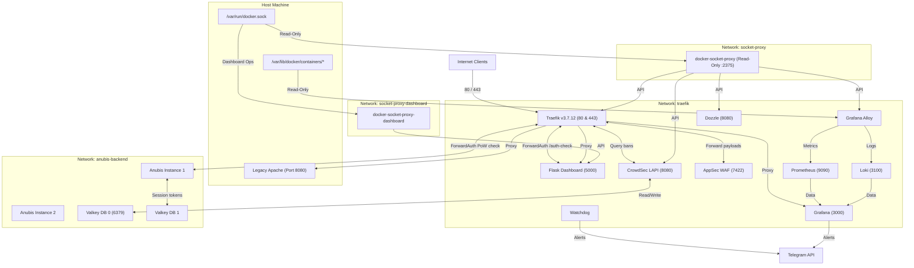
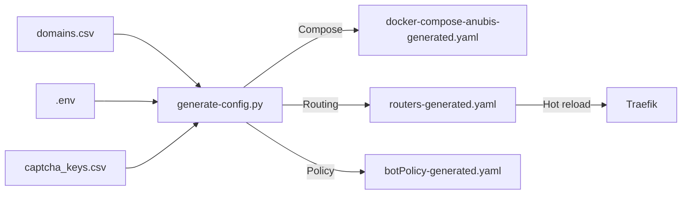

<div align="center">


# Traefik Pro Stack

**Your web. Locked down, lit up, production-ready.**

*Traefik + CrowdSec + Anubis + Grafana · Full-stack anti-DDoS & anti-bot infrastructure for multi-domain Docker environments.*

[](LICENSE)
[](https://doc.traefik.io/traefik/)
[](https://crowdsec.net)
[](https://anubis.techaro.lol/docs/)
[](https://grafana.com)
[](https://prometheus.io)
[](https://redis.io)
[](https://docs.docker.com/compose/)

</div>

---

## Table of Contents
1. [What Is This?](#what-is-this)
2. [The 3 Layers of Protection](#the-3-layers-of-protection)
3. [Requirements](#requirements)
4. [Quick Start (3 Steps)](#quick-start-3-steps)
5. [What to Edit & What to Leave Alone](#what-to-edit--what-to-leave-alone)
6. [How It Works Inside](#how-it-works-inside)
7. [Advanced Configuration](#advanced-configuration)
8. [Day-to-Day Operation](#day-to-day-operation)
9. [Production Hardening](#production-hardening)
10. [TL;DR — Complete Reference](#tldr--complete-reference)
11. [License](#license)

---

## What Is This?

This is a **self-hosted, production-grade edge gateway** designed to protect multiple Docker web applications (and legacy host services) with zero manual configuration drift. Instead of maintaining static proxy configs by hand, you manage routing through a single CSV file and environment variables. The stack handles the rest: TLS certificates, DDoS mitigation, bot filtering, Web Application Firewall, observability, backups, and alerting.

**Core capabilities at a glance:**
- **Automatic TLS** with Let's Encrypt (or local self-signed certs for dev).
- **Intrusion Prevention + WAF** via CrowdSec (blocks bad IPs and inspects payloads for SQLi/XSS).
- **Bot Defense** via Anubis (cryptographic Proof-of-Work challenges that block scrapers but are invisible to humans).
- **Single Sign-On** admin dashboard that also protects Grafana, Dozzle, and CrowdSec UI.
- **Full observability** (logs, metrics, dashboards) via Grafana, Prometheus, and Loki.
- **Automated backups** to cloud storage (optional) via Backrest (Restic + Rclone).
- **Health watchdog** that alerts via Telegram when certificates, DNS, or services drift.

**Who is this for?** Anyone running multiple web apps (WordPress, Symfony, Zend, Flask, etc.) on a single server who wants security and resilience without becoming a full-time network engineer.

---

## The 3 Layers of Protection

When a visitor types `https://yourdomain.com`, the request passes through three defensive lines before touching your app:

```
Internet
    │
    ▼
┌─────────────────────────────────────┐
│  Layer 1 — Edge (Traefik + CrowdSec)│
│  TLS, rate limits, IP bans, WAF     │
└─────────────────────────────────────┘
    │
    ▼
┌─────────────────────────────────────┐
│  Layer 2 — Bot Defense (Anubis)     │
│  Proof-of-Work challenge for bots   │
└─────────────────────────────────────┘
    │
    ▼
┌─────────────────────────────────────┐
│  Layer 3 — Your Application         │
│  WordPress, Symfony, Flask, etc.    │
└─────────────────────────────────────┘
```

**Fail-open by design:** If CrowdSec, the WAF, or Redis goes down, traffic is allowed through. The stack prioritizes availability over security during failures. You can switch to fail-closed in `traefik.yaml.template` if your threat model requires it.

---

## Requirements

- **Linux** host (Debian 12+, Ubuntu LTS, or Proxmox LXC).
- **Docker Engine ≥ 24.0** + Docker Compose v2 plugin.
- **Python 3.8+** with `venv` and `pip`.
- **Ports 80 and 443** free on the host.
- A **domain name** pointing to your server (for Let's Encrypt).

---

## Quick Start (3 Steps)

### Step 1: Initialize

```bash
make init
```

This creates a Python virtual environment, installs dependencies, and launches an interactive wizard that generates your `.env` file from the template.

### Step 2: Configure

Edit `.env` and set at least these:

```bash
nano .env
```

- `DOMAIN` — your root domain (e.g., `company.com`).
- `TRAEFIK_ACME_EMAIL` — valid email for Let's Encrypt alerts.
- `TRAEFIK_ACME_ENV_TYPE` — keep `staging` until everything works, then switch to `production`.

Edit `domains.csv` to define your routing:

```bash
nano domains.csv
```

```csv
# domain, redirection, docker_service, anubis_subdomain, rate, burst, concurrency
company.com, , landing-web, , , ,
www.company.com, company.com, noop, , , ,
crm.company.com, , crm-app, auth, 40, 80, 20
old-brand.com, https://company.com, noop, , , ,
```

For redirect-only domains without a backend container, use `noop` (or `redirect` / `ping`). This binds the router to Traefik's internal `ping@internal` service, avoiding missing-container warnings.

### Step 3: Launch

```bash
make start
```

The startup runs in 6 phases:
1. **Env sync** — merges new variables from `.env.dist` without overwriting your settings.
2. **Credential sync** — auto-generates secrets (dashboard key, Redis password, CrowdSec API key, etc.).
3. **Asset prep** — compiles templates, generates dynamic Traefik configs, and prepares Anubis assets.
4. **Network prep** — creates Docker networks and probes for host Apache.
5. **Security boot** — starts CrowdSec, PostgreSQL, and Redis first; waits until healthy before starting Traefik.
6. **Full deployment** — launches all remaining services and auto-configures Grafana Telegram alerts.

Check health:
```bash
make health
```

---

## What to Edit & What to Leave Alone

| ✅ Safe to edit | ❌ Never edit directly |
|----------------|----------------------|
| `.env` | `traefik-generated.yaml` |
| `domains.csv` | `docker-compose-anubis-generated.yaml` |
| `config/traefik/traefik.yaml.template` | `config/traefik/dynamic-config/*.yaml` |
| `config/crowdsec/acquis-base.yaml` | `config/crowdsec/acquis.yaml` |
| `config/crowdsec/profiles-base.yaml` | `config/crowdsec/profiles.yaml` |
| `config/anubis/botPolicy.yaml` | `config/anubis/botPolicy-generated.yaml` |

> **Golden rule:** Any file with "generated" in its name or inside `dynamic-config/` is overwritten on every `make start`. Change the **template or generator** instead.

---

## How It Works Inside

### Networks

Four Docker networks isolate services by risk level:

| Network | Purpose | Who's on it |
|---------|---------|-------------|
| `traefik` | Public routing | Traefik, Dashboard, Grafana, Prometheus, Loki, CrowdSec, etc. |
| `socket-proxy` | Read-only Docker API | Proxy that shields the host socket from Traefik, CrowdSec, Alloy, Dozzle |
| `anubis-backend` | PoW session cache | Anubis + Redis/Valkey (no outbound internet) |
| `crowdsec-backend` | IPS database | CrowdSec + PostgreSQL (completely internal) |

### Configuration Generation

```
domains.csv + .env
      │
      ▼
generate-config.py
      │
      ▼
config/traefik/dynamic-config/*.yaml
      │
      ▼ (hot reload)
   Traefik
```

If you need a custom middleware or router that isn't driven by `domains.csv`, add it as a **Docker label** on the container or as a new template in `generate-config.py`.

### Startup Sequence

The startup is **idempotent** — running it multiple times does minimal work and never recreates healthy containers unnecessarily.

### Middleware Chain (Security Order)

```
Request → [Redirect Regex] → (301/302 if matched)
       → [UA Blacklist Router] → (403 if matched)
       → [CrowdSec Bouncer] → (403 / CAPTCHA if banned)
       → [Buffering] → [Security Headers]
       → [Rate Limiter] → [Concurrency Limiter]
       → [Circuit Breaker] → [Retry]
       → [ForwardAuth / Anubis] → (PoW challenge)
       → [Compression] → Backend
```

The UA Blacklist is a separate high-priority router, not part of the middleware chain. To change this order, modify `generate-config.py`.

### Docker Socket Isolation

Services that need Docker metadata connect through a **read-only proxy** (`docker-socket-proxy`) instead of mounting `/var/run/docker.sock` directly. The Dashboard uses a **dedicated proxy** (`docker-socket-proxy-dashboard`) on its own isolated network (`socket-proxy-dashboard`) with minimal write permissions (exec, create, delete) needed for soft restarts, while keeping dangerous operations (build, images, volumes, swarm) blocked.

---

## Advanced Configuration

### Environment Variables

Key variables that affect operation:

| Variable | Default | What it controls |
|----------|---------|------------------|
| `DOMAIN` | `mydomain.com` | Root domain for dashboard and alerts |
| `TRAEFIK_ACME_ENV_TYPE` | `staging` | `staging` (test certs), `production` (real certs), `local` (self-signed) |
| `TRAEFIK_ACME_EMAIL` | — | Let's Encrypt notification email |
| `CROWDSEC_ENABLE` | `true` | Master switch for the firewall |
| `CROWDSEC_APPSEC_ENABLE` | `true` | Layer-7 WAF (payload inspection) |
| `ANUBIS_DIFFICULTY` | `3` | PoW difficulty: 1-2 (instant), 3-4 (recommended), 5 (aggressive) |
| `TRAEFIK_GLOBAL_RATE_AVG` | `60` | Requests/second per IP |
| `TRAEFIK_GLOBAL_RATE_BURST` | `120` | Burst bucket per IP |
| `TRAEFIK_GLOBAL_CONCURRENCY` | `25` | Max concurrent connections per IP |
| `TRAEFIK_TIMEOUT_ACTIVE` | `60` | Request timeout (seconds) |
| `TRAEFIK_TIMEOUT_IDLE` | `90` | Keep-alive timeout (seconds) |
| `TRAEFIK_HSTS_MAX_AGE` | `31536000` | HSTS header lifetime (seconds). **Test with 300 first!** |
| `TRAEFIK_MAX_REQUEST_BODY_BYTES` | `52428800` | Max body size (50 MB) |
| `TRAEFIK_MAX_RESPONSE_BODY_BYTES` | `52428800` | Max response size (50 MB) |
| `TRAEFIK_MAX_CONNS_PER_HOST` | `500` | Hard limit of connections to a single backend |
| `PROMETHEUS_RETENTION_DAYS` | `15` | Metrics history on disk |
| `PROMETHEUS_MEM_LIMIT` | `1G` | Prometheus RAM cap |
| `BACKREST_ENABLE` | `true` | Toggle cloud backups |

Secrets (`DASHBOARD_SECRET_KEY`, `REDIS_PASSWORD`, `CROWDSEC_LAPI_KEY`, `PROMETHEUS_REMOTE_WRITE_TOKEN`, etc.) are **auto-generated on first start** — do not create them manually.

### CrowdSec AppSec WAF

When `CROWDSEC_APPSEC_ENABLE=true`, the Traefik bouncer forwards request bodies to CrowdSec's AppSec listener on port `7422`. The Coraza engine inspects them against OWASP CRS rulesets. Matches result in immediate `403` + IP ban. The WAF is **fail-open**: if AppSec crashes, traffic continues.

### Custom Rate-Limit Flood Scenario

The `traefik-flood-429` scenario bridges a gap: Traefik's rate limiter returns `429`, but doesn't ban the IP. CrowdSec monitors logs for `429` responses. If an IP accumulates 50+ `429`s faster than 1 per second, it triggers a 24-hour ban.

Toggle with `CROWDSEC_RATE_LIMIT_BAN_ENABLE=true/false`.

### CAPTCHA Remediation

HTTP behavioral alerts (scanning, brute force) can trigger CAPTCHA challenges instead of bans. Register provider keys (Turnstile, hCaptcha, reCAPTCHA) in `config/crowdsec/captcha_keys.csv`. The Dashboard UI validates formats and tests keys online before saving.

> ⚠️ **Important:** Every domain using CAPTCHA must be added to your provider's widget configuration (e.g., Cloudflare Turnstile site settings). Otherwise the CAPTCHA fails to load and users are permanently blocked.

---

## Day-to-Day Operation

```bash
make start            # Full boot sequence
make stop             # Graceful shutdown
make restart          # Full stop + start
make restart traefik  # Restart single service
make logs traefik     # Follow logs
make shell crowdsec   # Open shell in container
make validate         # Check .env for errors
make health           # Run diagnostics
make crowdsec-decisions      # List active bans
make crowdsec-unban 1.2.3.4  # Unban an IP
make crowdsec-db-stats       # Database size & connections
make crowdsec-db-shell       # Interactive psql
make certs-info            # Certificate status
make check-updates         # Check for image updates
make help                  # Full command list
```

### Troubleshooting

**Certificates not issuing?**
- Verify DNS A records point to the server.
- Check `TRAEFIK_ACME_ENV_TYPE` is not `local` if you need real certs.
- Ensure ports 80 and 443 are open to the internet.

**Dashboard soft restart not working?**
- Verify `docker-socket-proxy-dashboard` is healthy.
- Check Dashboard logs: `make logs dashboard`.

**CrowdSec blocking legitimate traffic?**
- Add IPs to `CROWDSEC_WHITELIST_IPS` in `.env`.
- Disable `CROWDSEC_RATE_LIMIT_BAN_ENABLE` if AJAX-heavy apps trigger false positives.

**High memory usage?**
- Reduce `PROMETHEUS_RETENTION_DAYS` or increase `PROMETHEUS_MEM_LIMIT`.
- Check Valkey memory: `make shell redis` then `redis-cli INFO memory`.

---

## Production Hardening

On Debian / Proxmox hosts, apply these **outside Docker** for maximum resilience.

### Kernel Tuning (`sysctl`)

Create `/etc/sysctl.d/99-traefik-anti-ddos.conf`:

```ini
net.core.rmem_max = 7500000
net.core.wmem_max = 7500000
net.core.netdev_max_backlog = 10000
net.ipv4.tcp_max_syn_backlog = 8192
net.ipv4.tcp_tw_reuse = 1
net.ipv4.tcp_fin_timeout = 15
net.ipv4.tcp_keepalive_time = 60
net.netfilter.nf_conntrack_max = 262144
vm.overcommit_memory = 1
```

Reload: `sysctl --system`

### Host Resources

**File descriptors:** The default 1024 limit is exhausted under traffic spikes.
```bash
echo 'DefaultLimitNOFILE=65536' | sudo tee -a /etc/systemd/system.conf /etc/systemd/user.conf
sudo systemctl daemon-reexec
```

**Swap:** Causes unpredictable latency for proxies and in-memory DBs.
```bash
sudo swapoff -a
# Comment out swap entries in /etc/fstab
```

**Docker Live-Restore:** Survives daemon restarts without killing containers.
```json
// /etc/docker/daemon.json
{ "live-restore": true }
```

### CrowdSec Firewall Bouncer (Host-Level)

The Traefik plugin blocks at Layer 7 (HTTP) — malicious packets still reach the proxy. For maximum DDoS efficiency, install the host-level bouncer:

```bash
apt install crowdsec-firewall-bouncer-nftables
```

This drops packets at **netfilter** *before* they touch Docker. The container plugin remains as a fallback.

### Automated Hardening Check

`make start` runs a pre-flight check on Linux hosts that verifies sysctls, the firewall bouncer, file descriptor limits, swap, Docker live-restore, and `vm.overcommit_memory`. It warns if anything is missing but **never blocks** startup.

---

## TL;DR — Complete Reference

### Full Environment Variable Table

| Variable | Scope | Default | Description |
|:---|:---|:---|:---|
| `DOMAIN` | General | `mydomain.com` | Primary root domain. |
| `TZ` | General | `Europe/Madrid` | Server timezone. |
| `PROJECT_NAME` | General | `stack` | Compose project prefix. |
| `ANUBIS_DIFFICULTY` | Anubis | `3` | PoW difficulty (1-5). |
| `ANUBIS_CPU_LIMIT` | Anubis | `0.10` | CPU limit per Anubis instance. |
| `ANUBIS_MEM_LIMIT` | Anubis | `32M` | Memory limit per Anubis instance. |
| `CROWDSEC_ENABLE` | CrowdSec | `true` | Master firewall switch. |
| `CROWDSEC_UPDATE_INTERVAL` | CrowdSec | `15` | LAPI decision refresh interval (seconds). |
| `CROWDSEC_ENROLLMENT_KEY` | CrowdSec | — | CrowdSec Console enrollment key. |
| `CROWDSEC_APPSEC_ENABLE` | CrowdSec | `true` | WAF payload inspector toggle. |
| `CROWDSEC_COLLECTIONS` | CrowdSec | — | Space-separated hub collections. |
| `CROWDSEC_WHITELIST_IPS` | CrowdSec | — | Comma-separated IPs/CIDRs to bypass blocks. |
| `CROWDSEC_CAPTCHA_GRACE_PERIOD` | CrowdSec | `3600` | Seconds after CAPTCHA solve before re-challenge. |
| `CROWDSEC_RATE_LIMIT_BAN_ENABLE` | CrowdSec | `true` | Toggle `traefik-flood-429` ban scenario. |
| `TRAEFIK_LISTEN_IP` | Traefik | `0.0.0.0` | Bind address for ports 80/443. |
| `TRAEFIK_GLOBAL_RATE_AVG` | Traefik | `60` | Rate limit average (req/s per IP). |
| `TRAEFIK_GLOBAL_RATE_BURST` | Traefik | `120` | Rate limit burst bucket. |
| `TRAEFIK_GLOBAL_CONCURRENCY` | Traefik | `25` | Max concurrent requests per IP. |
| `TRAEFIK_TIMEOUT_ACTIVE` | Traefik | `60` | Active read/write timeout (seconds). |
| `TRAEFIK_TIMEOUT_IDLE` | Traefik | `90` | Idle connection timeout (seconds). |
| `TRAEFIK_MAX_REQUEST_BODY_BYTES` | Traefik | `52428800` | Max request body buffer (bytes). |
| `TRAEFIK_MAX_RESPONSE_BODY_BYTES` | Traefik | `52428850` | Max response body buffer (bytes). |
| `TRAEFIK_MAX_CONNS_PER_HOST` | Traefik | `500` | Max connections to a single backend. |
| `TRAEFIK_BLOCKED_PATHS` | Traefik | — | Comma-separated paths to block globally. |
| `TRAEFIK_BAD_USER_AGENTS` | Traefik | — | Comma-separated UA regex patterns to drop. |
| `TRAEFIK_TRUSTED_IPS` | Traefik | — | Trusted reverse proxy/CDN IPs/CIDRs. |
| `TRAEFIK_ACCESS_LOG_BUFFER` | Traefik | `1000` | In-memory log buffer size. |
| `TRAEFIK_LOG_LEVEL` | Traefik | `INFO` | Traefik log verbosity. |
| `TRAEFIK_HSTS_MAX_AGE` | Traefik | `31536000` | HSTS lifetime (seconds). **Test low first!** |
| `TRAEFIK_FRAME_ANCESTORS` | Traefik | — | Allowed iframe parent domains. |
| `TRAEFIK_ACME_EMAIL` | Traefik | — | Let's Encrypt contact email. |
| `TRAEFIK_ACME_ENV_TYPE` | Traefik | `staging` | `production`, `staging`, or `local`. |
| `TRAEFIK_TLS_BATCH_SIZE` | Traefik | `30` | Max domains per ACME request. |
| `WATCHDOG_TELEGRAM_BOT_TOKEN` | Watchdog | — | Telegram bot token for alerts. |
| `WATCHDOG_TELEGRAM_RECIPIENT_ID` | Watchdog | — | Telegram chat/group ID. |
| `WATCHDOG_CERT_DAYS_WARNING` | Watchdog | `10` | Cert expiry warning threshold (days). |
| `WATCHDOG_DNS_CHECK_INTERVAL` | Watchdog | `21600` | DNS check interval (seconds). |
| `WATCHDOG_CROWDSEC_CHECK_INTERVAL` | Watchdog | `3600` | CrowdSec health check interval. |
| `WATCHDOG_SYSTEM_CHECK_INTERVAL` | Watchdog | `300` | Host resource check interval. |
| `WATCHDOG_TRAEFIK_CHECK_INTERVAL` | Watchdog | `300` | Config drift check interval. |
| `PROMETHEUS_RETENTION_DAYS` | Telemetry | `15` | Metrics retention. |
| `PROMETHEUS_MEM_LIMIT` | Telemetry | `1G` | Prometheus RAM limit. |
| `PROMETHEUS_REMOTE_WRITE_TOKEN` | Telemetry | (auto) | Bearer token for Alloy → Prometheus auth. |
| `GRAFANA_AUTH_PROXY_WHITELIST` | Telemetry | — | IPs/CIDRs allowed for Auth Proxy. |
| `DASHBOARD_SUBDOMAIN` | Dashboard | `dashboard` | Admin UI subdomain. |
| `DASHBOARD_ANUBIS_SUBDOMAIN` | Dashboard | — | PoW-protect the login page (optional). |
| `DASHBOARD_ADMIN_USER` | Dashboard | `admin` | SSO username. |
| `DASHBOARD_ADMIN_PASSWORD` | Dashboard | `password` | SSO password. **Change before production!** |
| `BACKREST_ENABLE` | Backups | `true` | Toggle Backrest service. |
| `BACKREST_PROJECTS_DIR` | Backups | `/opt/docker` | Parent directory of Docker projects. |
| `BACKREST_DB_DUMPS_DIR` | Backups | `/var/backups/incoming` | Incoming SQL dump directory. |

### System-Managed Variables (Auto-Generated)

Never edit these manually in `.env`:
- `TRAEFIK_CERT_RESOLVER`
- `DASHBOARD_APP_PATH_HOST`
- `DASHBOARD_SECRET_KEY`
- `CROWDSEC_WEB_UI_PASSWORD`
- `CROWDSEC_DB_PASSWORD`
- `CROWDSEC_LAPI_KEY`
- `REDIS_PASSWORD`
- `ANUBIS_REDIS_PRIVATE_KEY`
- `PROMETHEUS_REMOTE_WRITE_TOKEN`
- `TRAEFIK_DASHBOARD_AUTH`
- `DOZZLE_DASHBOARD_AUTH`

### Generated Files (Do Not Edit)

- `config/traefik/dynamic-config/*`
- `config/traefik/traefik-generated.yaml`
- `config/crowdsec/acquis.yaml`
- `config/crowdsec/profiles.yaml`
- `docker-compose-anubis-generated.yaml`

### Repository Layout

```
.
├── .env.dist                          # Environment template
├── .env                               # Local config (git-ignored)
├── domains.csv.dist                   # Domain inventory template
├── domains.csv                        # Active domains (git-ignored)
├── Makefile                           # Command wrapper
├── VERSION                            # CalVer release tag
│
├── scripts/
│   ├── init.d/                        # Startup phases (00-06)
│   ├── generate-config.py             # Dynamic config compiler
│   ├── start.sh                       # Orchestrator
│   ├── restart-internal.sh            # Dashboard soft-restart trigger
│   ├── compose-files.sh               # Active compose file list builder
│   └── ...
│
├── config/
│   ├── traefik/                       # Static templates + generated configs
│   ├── crowdsec/                      # Base templates + generated configs
│   ├── anubis/                        # Bot policy + challenge assets
│   ├── dashboard/                     # Flask SSO admin UI
│   ├── grafana/                       # Dashboards & provisioning
│   ├── loki/                          # Log storage config
│   ├── prometheus/                    # Scrape configs & alert rules
│   ├── valkey/                        # Cache config templates
│   ├── alloy/                         # Collector pipeline config
│   └── watchdog/                      # Health monitor scripts
│
├── docker-compose-edge.yaml           # Traefik
├── docker-compose-security.yaml       # CrowdSec, PostgreSQL, Redis, Socket Proxy
├── docker-compose-observability.yaml  # Grafana, Loki, Alloy, Prometheus
├── docker-compose-dashboard.yaml      # Dashboard, Dozzle, Watchdog, Dashboard Socket Proxy
├── docker-compose-anubis.yaml         # Anubis base template
├── docker-compose-backrest.yaml       # Backups (optional)
└── docker-compose-maintenance.yaml    # Global 503 fallback
```

### Port Allocations

| Service | Internal Port | External Port | Network | Notes |
|:---|:---|:---|:---|:---|
| `traefik` | `80`, `443` | `80`, `443` (TCP/UDP) | `traefik` / Host | Public HTTP/HTTPS/HTTP-3 boundary |
| `traefik-api` | `8080` | None | `traefik` | Internal API & dashboard |
| `dashboard` | `5000` | None | `traefik` | Flask admin + SSO auth-check |
| `crowdsec-lapi` | `8080` | None | `traefik` | CrowdSec Local API |
| `crowdsec-appsec` | `7422` | None | `traefik` | Inline WAF listener |
| `crowdsec-db` | `5432` | None | `crowdsec-backend` (internal) | PostgreSQL backend |
| `docker-socket-proxy` | `2375` | None | `socket-proxy` | Read-only Docker API gateway |
| `docker-socket-proxy-dashboard` | `2375` | None | `socket-proxy-dashboard` | Dashboard orchestration proxy |
| `redis` | `6379` | None | `anubis-backend` (internal) | Valkey (DB 0: bans, DB 1: PoW sessions) |
| `grafana` | `3000` | None | `traefik` | Dashboards & alerting |
| `prometheus` | `9090` | None | `traefik` | Metrics TSDB |
| `loki` | `3100` | None | `traefik` | Log aggregation |
| `alloy` | `12345` | None | `traefik` | Log & metric collector |
| `dozzle` | `8080` | None | `traefik` | Container log viewer |
| `backrest` | `9898` | None | `traefik` | Backup Web UI (optional) |
| `apache-host` | `8080` | `8080` | Host | Legacy Apache on host |

### Architecture Diagrams

#### Component Connectivity


```mermaid
flowchart TD
    subgraph Host_Network ["Host Machine"]
        DockerSock["/var/run/docker.sock"]
        ApacheHost["Legacy Apache (Port 8080)"]
        DockerLogs["/var/lib/docker/containers/*"]
    end

    subgraph socket_proxy_network ["Network: socket-proxy"]
        SocketProxy["docker-socket-proxy (Read-Only :2375)"]
    end

    subgraph socket_proxy_dashboard_network ["Network: socket-proxy-dashboard"]
        SocketProxyDash["docker-socket-proxy-dashboard"]
    end

    subgraph traefik_network ["Network: traefik"]
        Traefik["Traefik v3.7.12 (80 & 443)"]
        Dashboard["Flask Dashboard (5000)"]
        CrowdSec["CrowdSec LAPI (8080)"]
        AppSec["AppSec WAF (7422)"]
        Alloy["Grafana Alloy"]
        Loki["Loki (3100)"]
        Prometheus["Prometheus (9090)"]
        Grafana["Grafana (3000)"]
        Dozzle["Dozzle (8080)"]
        Watchdog["Watchdog"]
    end

    subgraph anubis_network ["Network: anubis-backend"]
        Anubis1["Anubis Instance 1"]
        Anubis2["Anubis Instance 2"]
        RedisBans["Valkey DB 0 (6379)"]
        RedisSessions["Valkey DB 1"]
    end

    Internet["Internet Clients"] -->|80 / 443| Traefik
    Traefik <-->|Query bans| CrowdSec
    Traefik <-->|Forward payloads| AppSec
    CrowdSec <-->|Read/Write| RedisBans
    Traefik <-->|ForwardAuth /auth-check| Dashboard
    Traefik <-->|ForwardAuth PoW check| Anubis1
    Anubis1 <-->|Session tokens| RedisSessions
    Traefik -->|Proxy| Dashboard
    Traefik -->|Proxy| Grafana
    Traefik -->|Proxy| ApacheHost
    DockerSock -->|Read-Only| SocketProxy
    DockerSock -->|Dashboard Ops| SocketProxyDash
    SocketProxy -->|API| Traefik
    SocketProxy -->|API| Alloy
    SocketProxy -->|API| CrowdSec
    SocketProxy -->|API| Dozzle
    SocketProxyDash -->|API| Dashboard
    DockerLogs -->|Read-Only| Alloy
    Alloy -->|Metrics| Prometheus
    Alloy -->|Logs| Loki
    Prometheus -->|Data| Grafana
    Loki -->|Data| Grafana
    Watchdog -->|Alerts| Telegram["Telegram API"]
    Grafana -->|Alerts| Telegram
```

#### Config Generation Pipeline


```mermaid
flowchart LR
    dist["domains.csv"] --> generator["generate-config.py"]
    env[".env"] --> generator
    captchas["captcha_keys.csv"] --> generator
    generator -->|Compose| compose["docker-compose-anubis-generated.yaml"]
    generator -->|Routing| routers["routers-generated.yaml"]
    generator -->|Policy| policy["botPolicy-generated.yaml"]
    routers -->|Hot reload| Traefik
```

### Completed Hardening Checklist

| Hardening Item | Status |
|:---|:---|
| Dashboard isolated from host Docker socket (dedicated proxy) | ✅ |
| Buffering size limits (50 MB default) | ✅ |
| WriteTimeout aligned with ReadTimeout | ✅ |
| Prometheus remote_write Bearer auth | ✅ |
| maxConnsPerHost limit (500) | ✅ |
| Circuit breaker global | ✅ |
| Retry middleware (2 attempts) | ✅ |
| no-new-privileges on maintenance & alloy | ✅ |
| Alloy healthcheck | ✅ |
| Valkey maxmemory bumped to 512 MB | ✅ |
| DDoS detection alerts (Grafana + Prometheus) | ✅ |
| TLS cipher suites delegated to Go defaults | ✅ |
| Static assets rate limit (generous bucket) | ✅ |
| Loki compaction tuned for slow disk | ✅ |
| Dashboard healthcheck endpoint (`/healthz`) | ✅ |
| Host hardening pre-flight check | ✅ |

---

## License

MIT
